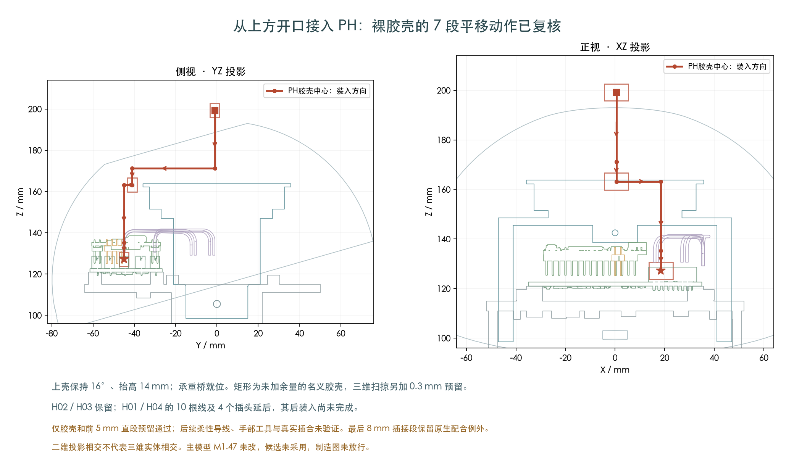
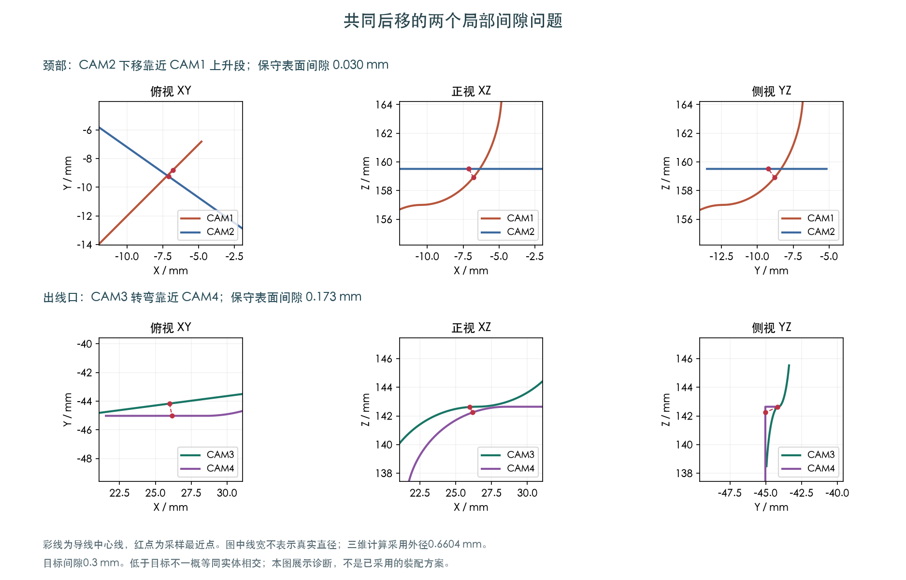

# 新增上方PH插接路径，完整带线装配仍未完成

新增一条裸PH胶壳从上方开口接入的明确路径，7段平移用封闭实体的连续扫掠复核通过。

这条路径采用H02/H03先装、H01/H04延后的顺序，桥已经就位，上壳保持16°/+14mm。四根导线最前5mm直段另有24段扫掠通过（不含最终8mm插合段），余下柔性导线与完整工序仍未通过。

主模型M1.47没有修改。本页记录装配候选的诊断与比较；不是制造放行。

## 两处卡点

- 颈部：CAM2中段下移时靠近CAM1的上升段，原有限采样的保守表面间隙约0.030mm。
- 身体插头旁：CAM3的转弯靠近CAM4，原保守间隙约0.173mm。

研究采用0.6604mm导线外径、0.3mm预留。图线是中心线；这两个下界不是实际最小间隙，也不能一概当作实体相交。

## 已比较的方向

- **分两次升高，经上方开口接入PH**：裸胶壳7段平移的封闭实体扫掠复核通过；保留0.3mm预留，初始8mm插合段有已记录的原生配合例外。四根线前5mm直段另有24段扫掠通过；余下柔性导线尚未验证。 [原始结果](../../PH_shell16_stepped_entry/verification.json)
- **CAM2局部绕开CAM1**：检查171种配置、展开18个可达状态，所选控制范围内未连到目标。 [原始结果](../shell16_second_wire_detour/screen.json)
- **提前调整导线高度**：12个单线候选的抬升通过；36种四线组合中6种通过抬升，但继续后移都未通过。 [原始结果](../shell16_early_wire_planes/screen.json)
- **临时扭开自由线尾**：3°、3.5°局部对桥间隙通过，但四线合并仍未通过；4°时对桥的表面间隙上界约0.266mm，已低于0.3mm目标。 [原始结果](../shell16_splay_clearance/diagnosis.json)
- **关闭上壳时插PH**：同一插头和障碍物下，延长至600秒，展开2286状态，仍未找到完整路径。 [原始结果](../../PH_rotated_entry_extended/screen.json)
- **保持上壳打开后插PH**：搜索展开2413个状态后仍未找到完整路径；保留5556个待搜索状态，不代表不存在路径。 [原始结果](../../PH_shell16_entry/screen.json)
- **H01/H04延后，再插PH**：展开2023状态后未找到完整路径；H01/H04明确延后，不能据此省略后装验证。 [原始结果](../../PH_shell16_deferred_entry/screen.json)

临时扭线的数值检查保留原圆弧误差，对边缘结果细分原弦线，并对桥表面的距离另做下界/上界检查。
没有通过缩小导线、插头、降低0.3mm预留或删去障碍物来消除问题。
3.5°只是本次测试的一个局部可行角度，不是全局最大角度，也不是完整动作通过。

## 打开上壳后插接的范围

上壳组保持16°、上抬14mm，固定承重桥位于装好位置；29个其他插接空间及14根固定身体线继续参与，H02使用已经记录的新走向。
这次目标改为机身右侧外部空间，PH胶壳不必穿颈孔。上壳、后板插头作为一个整体变换。
另作一个顺序候选：H02/H03先装、H01/H04延后；暂不装入的10根导线和4个插头逐项列在报告中，之后仍必须检查其装入过程。
此检查只有裸PH胶壳的既有保守包络，四根CAM导线尚未随胶壳检查；真实插合、手部空间和连接后收线仍待完成。

## 接下来仍可在到货前做的事

继续选择可执行的装配顺序，并把身体端插接、完整导线和头部装入一起衔接；随后处理H01/H04、其余跨关节线与FFC、扎带和工具。
当前失败仅限所列参数族、网格和搜索时长，不能据此宣布所有方式都不可行。
供应商按图制作已确定；公开原厂资料继续作为来源。具体配套端子/线尾/舵盘未公开的尺寸仍要厂家回复，最终裁线图尚未放行。

[此前四段刚体和前两段含线检查](../shell16_joint_feed/index.html) · [本次来源与命令](publication.json)
