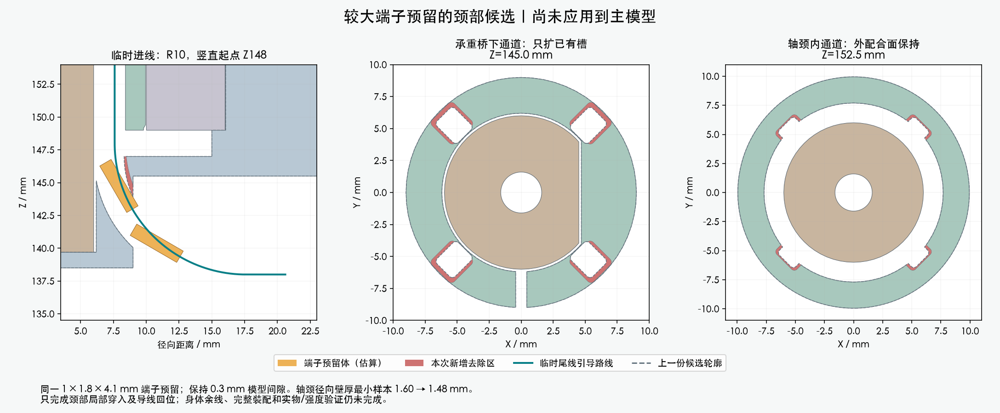

# 较大端子预留：颈部局部候选

**局部几何 PASS；独立候选，未应用主模型。完整线束仍为 BLOCKED。**

## 做了什么

统一采用上部研究的 1×1.8×4.1 mm 端子空间要求，保持 0.3 mm 模型间隙。
这仍是 ASSUMED 预留体，不是厂家完整压接外形。旧 R8 动作会靠近固定反力轴；
本次先把临时下弯道改为 **R10、竖直起点 Z148**。端子通过后，导线再回到
旧 R8/Z147 引导线；中央和上部几何基准保持，所有真实硬件位置与尺寸保持。

只在两件**已有未采用候选**上扩现有通道：Yaw_Base 再去除约 26.05 mm³，
Pitch_Yoke 再去除约 103.90 mm³。没有增加零件或改动主模型的打印件。

## 这次检查覆盖的范围

- 回读清理后的 Blender，209 个机器人源实体、29 个对插预留、14 根既有固定线均计入。
- 四个方向各 410 个有界连续区间：端子穿入、颈部尾线及 R10→R8 回位未检出相交。
- 端子间隙保守下界约 0.308 mm；导线表面间隙下界约 0.306 mm。
- 四方向两两检查共 6 组，端子与其他导线、导线之间的保守扫掠体互不相交。
- 两件保存网格均为单一闭合实体，无退化三角面。几何清理不放宽间隙要求；
  BVH 距离异常项用双精度全三角面距离复算，顶点偏差保持在 0.001 mm 内。
- 轴颈圆柱段 17 个截面、每面 720 条径向射线：最小壁厚样本 **1.601→1.479 mm**。
  这是局部材料代价，不是全部零件最小壁厚或 PA12 承载合格结论。

## 还不能放行的部分

临时 R10 段比旧段多占约 2.142 mm 导线材料，必须由
松散的身体侧余线提供；**不是增加同样的最终裁线长度**。整段余线、公共 PH 胶壳、
手/工具操作以及身体插头最后接入尚未完成，不能把颈部通过写成整套能装。

中央直穿也作了比较：未装反力件时只有中心位置通过该直线路径检查。
这只是紧固孔处的空隙，没有完成随后移入旁侧槽位和安装轴芯的过程，未采用该装法。
原整头/上壳动作仍有碰撞，四枚 CAM 内六角螺钉仍待用户确认；本候选不替代这些事项。

下一步把身体端保持未插接，完整放置余线、PH 胶壳并验证分步装配。通道改动需在
完整方案可审阅后交用户确认；真实端子、打印配合与动态弯折仍需实物验证。

[局部验证](verification.json) · [构建记录](construction.json) · [网格清理](cleaned/storage.json) ·
[11组进线比较](lower_bend/screen.json) · [独立 Blender](cleaned/candidate.blend) ·
[此前完整装配失败证据](../index.html)
