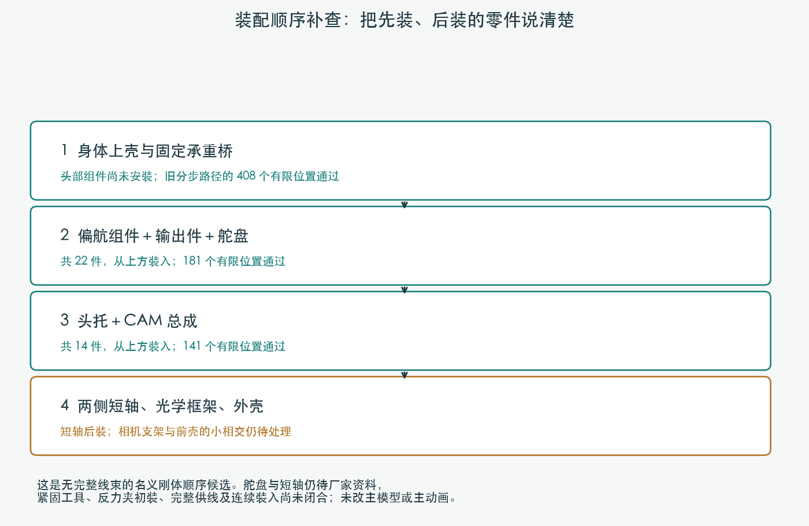
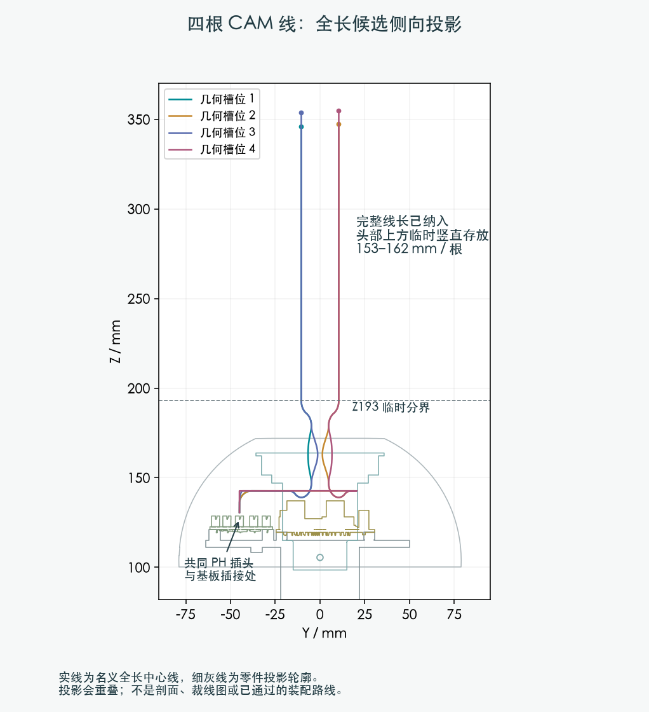
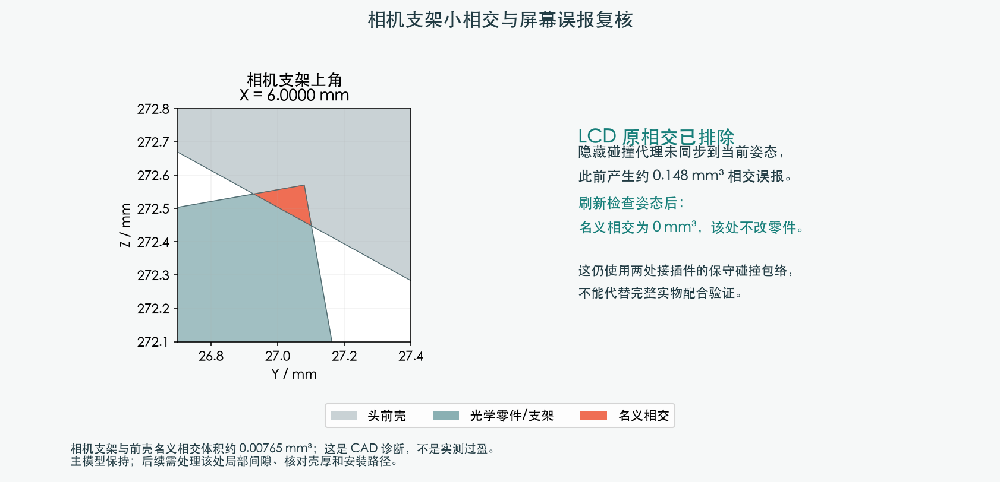

# 分步装配与完整 CAM 线长：本轮补查

**局部装配顺序有进展，完整线束仍为 BLOCKED。主模型 M1.47、结构参数和硬件文件未改。**

## 更合理的刚体顺序

身体上壳与固定承重桥先落位（408 个有限位置），再从上方装偏航组件及舵盘
（22 件，181 个位置），接着放头托与 CAM（14 件，141 个位置），最后装两侧短轴。
这些有限位置未检出名义刚体相交；原动画中把舵盘随头托一起下降的组合会碰到输出件。
尚未更新主动画，因为完整线束与反力夹初装仍未完成。SCS0009 舵盘、短轴与锁紧仍待厂家依据。

## 四根线的完整材料已经放进候选

本轮把每根既有名义全长都保留，约 153–162 mm 的头侧未装材料暂时竖直放在头部上方。
身体共同 PH 胶壳、28 个其他插接分配体及 14 根既有电源/信号线也纳入检查。
这是新的完整材料候选，不是裁线尺寸，也没有把临时余线额外加到最终线长。

| 动作候选 | 已证实的结果 |
| --- | --- |
| 插头与整条线随承重桥移动 | 首次抬升间隙下界不足；后移/抬高阶段胶壳与既有导线发生名义相交 |
| 身体端插头不动，前段导线变形 | 10 组有限变形候选都遇到间隙或弯曲半径筛查问题 |
| 承重桥沿固定竖直线尾滑动 | 下方弯道与承重桥/轴承的间隙要求未满足 |
| PH 胶壳由开口颈部穿入 | 直线退出 8 mm 的分配体检查通过；固定姿态、2 mm 网格搜索未找到通路 |
| 桥已落位，身体上壳最后归位 | 两种全线长候选各 61 个有限位置未检出碰撞；不能替代前面未通过的步骤 |

检查没有隐藏固定导线、缩小插头或端子，也没有降低 0.3 mm 项目间隙分配。
有些失败是保守间隙界限不足，并不等于实际穿透。所试路线有限，不代表所有方案都不可能。
下一步需要把身体段和颈部段的临时形状一同设计；没有理由因此再改变供应商制作方式。

## 修正检查误报，保留真实待处理项

隐藏的 LCD 碰撞代理未同步到当前姿态，曾造成约 0.148 mm³ 相交误报。
统一依赖图求值后，该处名义相交为 0，不改 LCD 或头壳。
相机支架上角与前壳的 **0.00765474 mm³** 小相交仍存在，需处理局部间隙并核对壳厚和装入路径。
Pitch 锁紧件约 0.000036 mm³ 的源接口接触也单独记录；未把未定型舵盘接口当作合格配合。

已统一重算相关新检查。全部结果只是名义几何诊断；真实线材/压接外形、夹持、扎带、工具、
其余跨关节线与 FPC、连续路径及 PA12 强度仍未闭合。候选打印件尚未采用，无制造放行。

[结果与来源](publication.json) · [刚体分组](screen.json) · [头部后装顺序](pitch_stages/screen.json) ·
[源接口诊断](pitch_stages/interface_contacts/diagnosis.json) · [完整供线原始结果](../bridge_wire_stock/screen.json) ·
[上一级汇总](../index.html)
