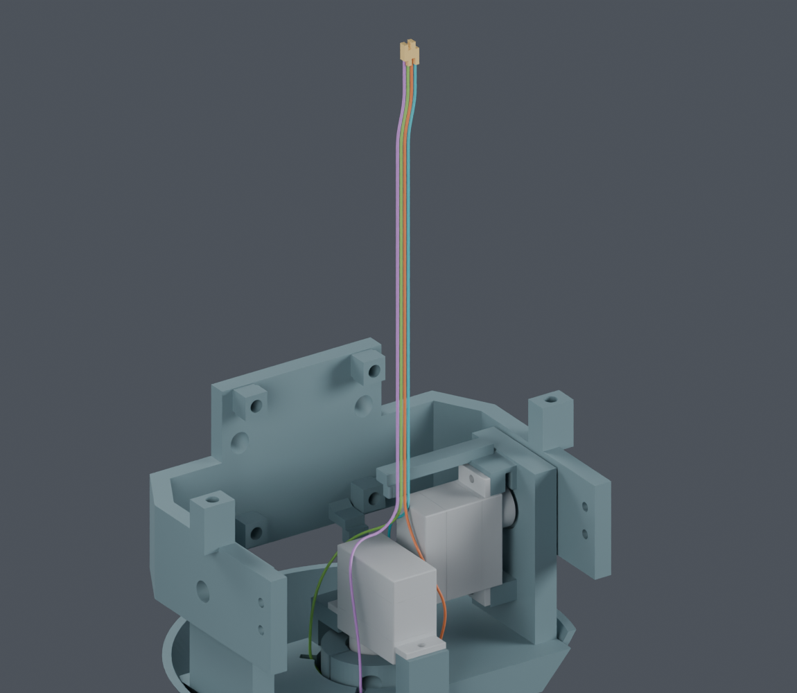
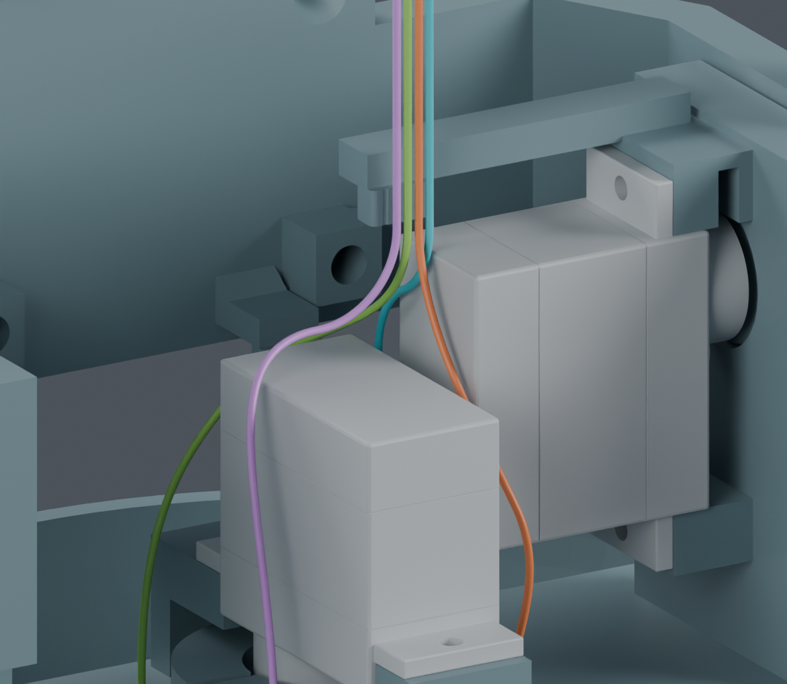

# CAM 逐根穿线与回位候选

主模型 M1.47 保持不变。这里使用尚未采用的 J3M/CAM 固定座研究几何，展示装配顺序；不是供应商制作图或完整装配放行。

## 当前结果

四根线按几何槽位 **3 → 2 → 1 → 0** 穿入。这个编号不是电气针脚号。

1. 未穿的线先留在颈部出口上方 13 mm。轮到该线时，沿原竖直方向退回，再进入弯曲路线；四组整段端子扫掠及初始微小转向的包络检查通过。**这仍要求下方能送线/退线，相关整段余线尚未设计。**
2. 每次只穿一根，先穿好的线完整保留，其余线也留在检查中。上端暂不向 CAM 固定位置收拢。所选较大空间分配通过 4205 个有限位置检查；新增 **1228 个连续区间**覆盖完整上部行程。另有 11016 次端子角点位姿对照和 84 次竖直位姿对照，用于核对运动界限实现。
3. 四根全部穿入后，临时 X 偏移 0.2 mm、Y 偏移 1.8 mm 逐渐回到既有入座起点，并恢复上方 X 过渡。41 个有限位置及新增 **256 个连续区间**通过；全程半径、自由末端长度和普通线间间隙分别用独立数学界限检查。
4. 回位终点与既有侧向入座起点的最大坐标差约 0.00000222 mm，小于明示的 0.0001 mm 数值衔接限值。同样较大端子预留盒已通过后续入座的 256 个连续区间，以及调整临时装配动作后的四段弯线 1735 个连续区间。[后续尺寸统一复核](../large_contact_downstream/index.html)。

弯曲段采用解析圆弧或有界 Bezier/五次曲线。41 个回位位置的最小半径下界 7.0357 mm，当前设计要求 7 mm；末端直线至少保留 5.0252 mm。长度差只由自由末端直线补偿，不拉长导线。总长基于既有折线分配，不是最终裁线长度。

## 空间与资料边界

- 导线外径 0.6604 mm；普通结构和线间采用 0.3 mm 名义表面余量。
- 这里的端子 **1 × 1.8 × 4.1 mm** 是请求的空间分配，**ASSUMED**，不是 JST 给出的完整最大外形。端子对导线和其他端子只检查不穿透，没有宣称 0.3 mm 端子间余量。
- 旧 0.8 × 1.35 × 3.9 mm 方盒在另一条临时路线下也通过有限位置检查，不能把两个方案当作完全相同的动作。
- [JST 官方 SH 图纸](https://www.jst-mfg.com/product/pdf/eng/eSH.pdf)与[APSH 目录](https://www.jst-mfg.com/product/pdf/eng/eAPSH.pdf)可用于核对同料号 SSH-003T-P0.2-H。锁止弹片及完成压接后的完整外形没有由本研究确认。
- 根部扎带在这几步尚未安装。其穿绕、收紧，以及实际端子入壳仍未完成。

## 查看

[独立 Blender 研究文件](review.blend) · [41 个回位位置及长度/曲率记录](screen.json) · [逐根穿入检查](../shifted_ordered_feed_handle05/screen.json) · [回退衔接扫掠](../ordered_feed_retraction/screen.json)

## 下方供线审查

现有上部过程还没有放置身体侧剩余材料：从 13 mm 暂存位置开始，每根约有 140–149 mm 未纳入模型；退回穿线起点后，每根约 153–162 mm。它们是原有材料的暂存需求，不是额外增加裁线长度。[材料账与下一步装配研究](../body_supply/README.md)。

拟评估先在机身外完成头部穿线，身体端保持松散，再让完整头部总成带线落位。旧身体装配报告只含桥和轴承，不能直接当作完整带线头部的验证。

[上部连续检查](../ordered_feed_continuous/screen.json) · [运动界限与角点核对](../ordered_feed_continuous/BOUND_METHOD.md) · [回位连续检查](continuous.json) · [全程曲率与长度界限](math_bounds.json)

完整线束仍 BLOCKED：下方供线、扎带、实际端子插装、其他七根跨关节线和 FPC、供应商最终裁线图尚未全部完成。没有修改硬件文件、提交供应商表单或下单。
