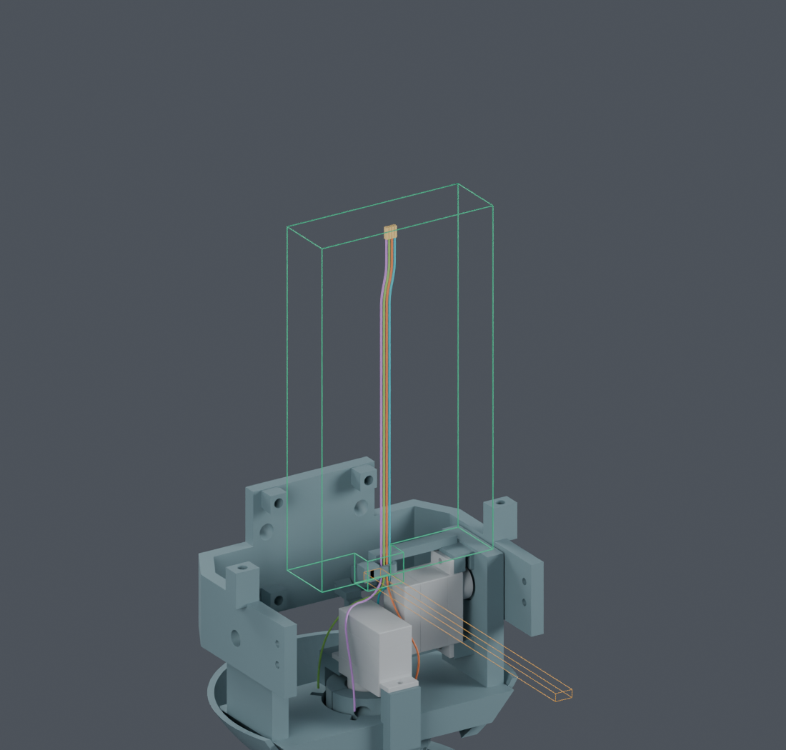
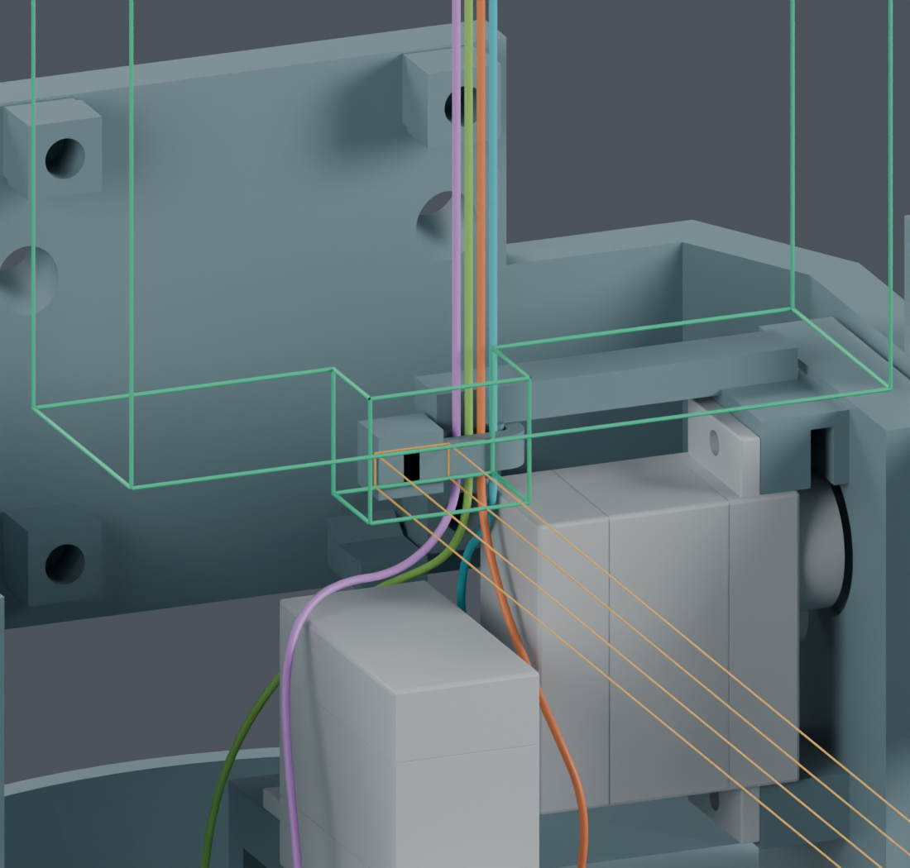

# CAM 根部扎带：当前装配阶段的工具空间与穿线限制

本轮把此前“独立舵机托架＋45 mm 局部线头”的检查，扩展到四线成形前的完整候选装配阶段：219 个结构实体、12 段导线和 4 个名义散端子均保留。主模型 M1.47、打印件、STL 和正式动画未修改。

| 项目 | 结果与范围 |
|---|---|
| 剪尾工具从上方直线接近 60 mm | 原 0° 方向名义不相交，四根完整线尾未挡住工具；另有 +15° 独立候选通过 |
| 工具对扎带头、带身的间隔 | 约 0.25 mm，未满足通用 0.3 mm 余量，因此余量项仍为 BLOCKED |
| 扎带尾部朝外的 110 mm 操作空间分配 | 名义检查 PASS；扎带出口的边界接触单独记录 |
| 散端子穿过已经收紧的最终扎带 | 四个槽位的所检查竖直路径均为 BLOCKED；目录包络同时碰到打印座和带身 |
| 扎带初次穿入、收紧、剪断及真实抓持 | NOT_TESTED；工具空间通过不代表这些操作已完成 |

绿色线框为剪尾工具分配，橙色线框为扎带尾操作空间；仅显示边线便于查看，计算使用完整实体。线色与几何槽位不代表电气针序。

工具是依据 KNIPEX 79 22 125 目录尺寸构造的保守方盒，具体钳口、张开动作和手部仍为 ASSUMED。10 个角度各自检查完整直线接近，不表示工具可以在这些角度之间连续转动。距离查询上限 0.301 mm 只代表至少达到该值，不是所有零件的真实最小间距。

散端子使用 0.8 × 1.35 × 3.9 mm 目录外形包络，不能据此宣称实物必然碰撞。该结果只排除了“扎带先收紧，再沿这四条竖直轴穿入端子”的名义路线。后续必须先完成导线放入，再收紧根部扎带；仅松开扎带也尚不足以证明可装入，因为所查路径还碰到打印座。完整初次穿入、暂放和落座动作继续保留为未完成，不为此直接给结构开孔。

[完整工具与尾部空间检查](screen.json) · [收紧后穿端子的失败记录](contact_feed.json) · [独立 Blender](review.blend) · [回到四线成形结果](../../index.html)

完整线束为 **BLOCKED**，没有最终供应商裁线图或制造放行。

后续已补齐[未装根部扎带时的四线局部入座](../root_seating/aligned_tails/README.md)：1.5 mm 行程的 256 个连续区间通过。它只解决绝缘线放入固定槽，初次散端子穿到该起点、扎带穿绕与收紧仍未完成。

新增[同料号端子官方图](../../../../ssh_catalogue_addendum/README.md)显示，锁止弹片不包含在原 1.35 mm 尺寸线内；本页旧端子方盒检查不是完整实物外形验证。
