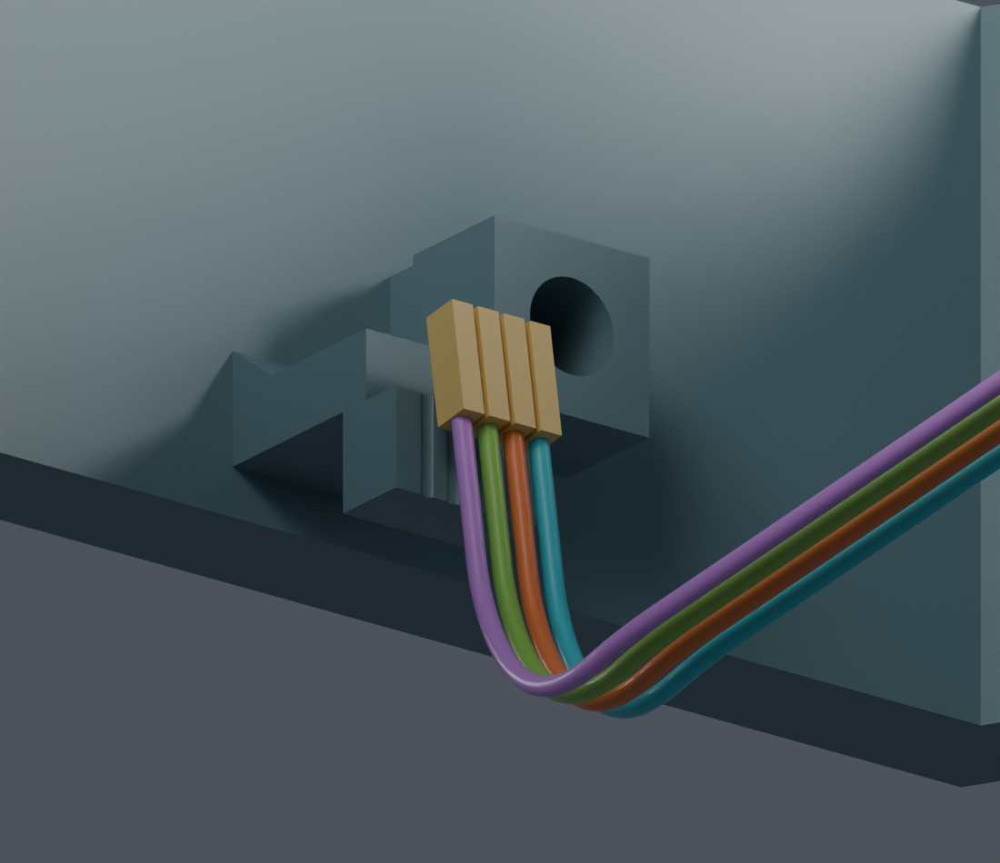
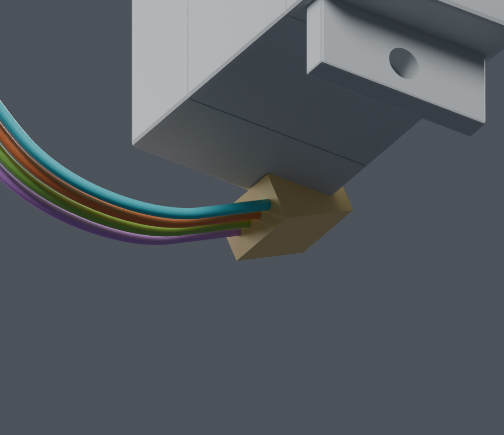
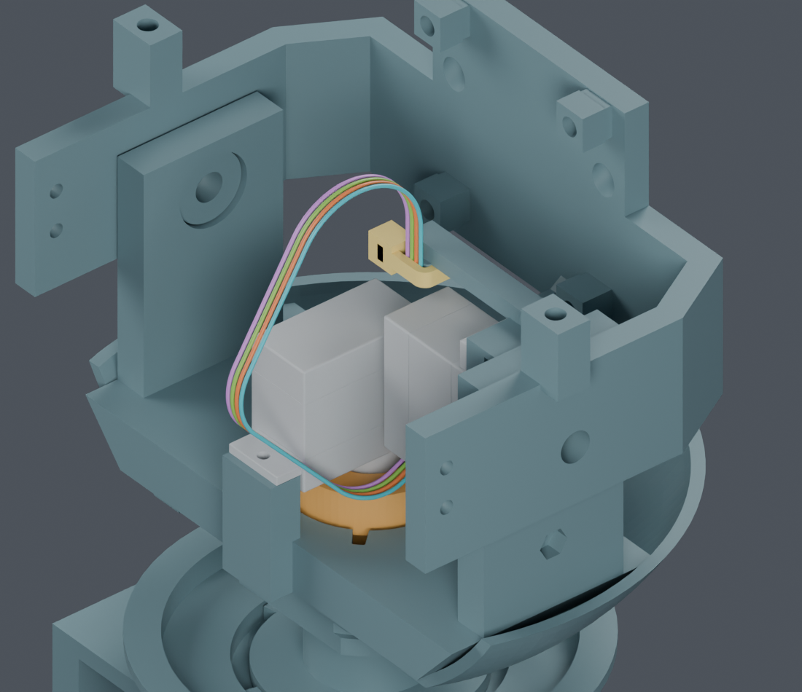

# CAM端子资料与成形复核

供应商按图制作已确定。公开资料由项目查询，MORI走线、分支和长度图由项目设计。主模型M1.47、正式PCB、STL和正式装配视频未改。

## 最新：新路线的四线成形动作连续通过

[当前四段路径及步骤衔接](../lifted_end2/index.html)：最后一根从负侧绕开原相交位置，四段规定成形动作已连续通过；板卡8→2mm连续下降保持通过。初始穿线、端子入壳、扎带和完整装配仍未完成，主模型未改。下文保留旧路线的端子及间隙记录。

## 找到的资料与证据边界

[JST官方SH目录](https://www.jst-mfg.com/product/pdf/eng/eSH.pdf)第2页给出SSH-003T-P0.2-H端子标称跨度0.8×1.35×3.9mm、AWG32–28和绝缘外径0.4–0.8mm范围。[保存的官方目录](../../../supplier_made_harness/recheck_20261004/JST_SH.pdf)哈希与检查记录一致。

本次按跨度构造长方体检查包络。它不是完整厂家CAD，也不是实际压接后的轮廓或公差。CAM插座只有SH1.0系列信息，真实厂牌、完整料号和针腔视图仍未确认，不能据此放行互配或针序。

新增[同料号端子的官方细节图](../../ssh_catalogue_addendum/README.md)显示，下方锁止弹片超出上述1.35mm尺寸线。该方盒不能理解为完整外形最大包络；历史检查结果只保留原声明范围，不能直接用于真实端子装配放行。

黄铜色长方体是端子检查包络。上图仅隔离显示头托和线端以便查看；其他零件仍参与检查。四色不是电气针序。

## 连续检查发现原41位置筛查漏检

原最大抬高9mm、最终直接回到安装高度的路线，散端子在41个位置均保留0.3mm间隙。但连续检查在成形参数约0.9867附近发现：端子与头托间隙约0.298mm，低于0.3mm要求。

已证明1480个区间，另31个小区间未通过后停止细分；**全过程覆盖为否，连续结果为BLOCKED**。这是明确的名义间隙不足，不能把之前的41位置PASS写成完整路线通过；也不能仅凭这一数值声称端子已经穿入材料。未扩大孔槽或删掉周围实体。

末段导线落槽另作检查：对已有有槽托床检查实际线径无穿透，其他区域保持0.3mm。51个末段位置未发现导线本体穿入托床；这份有限检查不能替代未完成的连续末段验证。名义槽半径0.35mm和最大线半径0.3302mm间只有约0.02mm径向余量，实际配合仍需试打。

## 新的装配顺序候选：在上方2mm完成成形

先试了6mm线端抬高：线与端子有限位置通过，但CAM板从12mm下降到6mm时，板上麦克风及元件会碰到头托，因此整段未通过。

随后缩为2mm：先把散端子停在最终位置上方2mm，准备装入胶壳；CAM板从上方8mm降至2mm完成6mm相对插合，再沿既有落座曲线降到0mm。模型不拉长导线、不改支架，不移动最终板卡和插座。

| 子项 | 当前证据 |
|---|---|
| 2mm成形路线，四根线及标称散端子对已装实体 | PASS，71个有限位置；最大临时线环抬高仍为9mm |
| CAM板从8mm下降到2mm、插头留在2mm | PASS，后续1057个连续区间已覆盖刚体与四线 |
| 与原落座曲线的端点衔接 | PASS，最终自由端与既有h=2mm曲线端点一致，总线长不变 |
| 新路线完整连续成形 | 未完成；后续已发现线间实体相交，停止只算线对结构件的旧路线 |
| 四线之间及上游导线 | BLOCKED；参数0.8处中心线距离上界0.527150mm，小于两线半径之和0.6604mm |
| 端子对导线 | 有限位置未检出相交，但0.3mm操作裕量未通过；装壳顺序未完成 |
| 端子插入胶壳、扎带收紧及初次颈部穿线到此初态 | NOT_TESTED |

裸端子盒在1mm节距下只有0.2mm标称间隙，不满足原0.3mm裕量；实际压接外形、四个自由端的操作顺序和装壳过程仍待处理。

## 先装胶壳再弯曲的既定路线未通过

局部隔离视图显示相关舵机和胶壳；检查仍用完整工序实体。9mm候选有位置仅剩约0.112mm间隙。增大到12、15、18mm的轨迹均有相交；图中12mm候选与俯仰舵机相交约9.65mm³。保留失败，不为此给支架开孔；这些检查并非证明所有预装胶壳工序都不可能。

本工序未安装CAM板、显示支架和头壳，CAM扎带尚未收紧，已有Yaw接触只沿用不动的前4.3mm。线束座、颈部通道及四枚CAM内六角螺钉仍属未全部采用的候选。主模型未改，没有采购或制造放行。

其余七根跨关节功能线、USB完整尾线、LCD排线、相机FPC及身体固定还需完成。供应商最终分支图和裁线图尚未发布，原有参考长度不能当作裁线尺寸。

[未通过的连续记录](../continuous/screen.json) · [曲线公式复核](../continuous/math_audit.json) · [新的2mm候选](../lifted_end2/screen.json) · [6mm方案的板卡冲突](../lifted_end/screen.json) · [端子41位置](screen.json) · [胶壳失败记录](../housed/screen.json) · [独立Blender](review.blend) · [命令](commands.json) · [交付记录](review_manifest.json)
