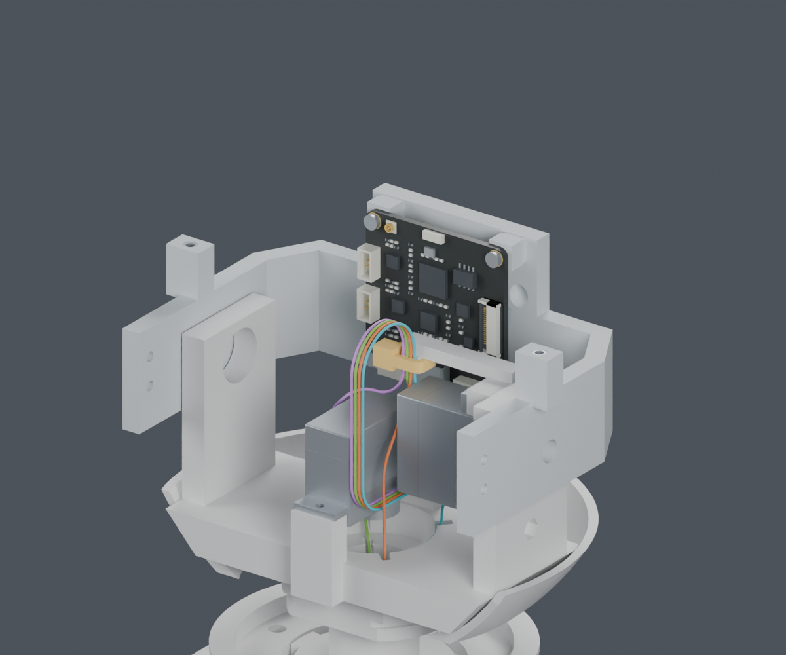
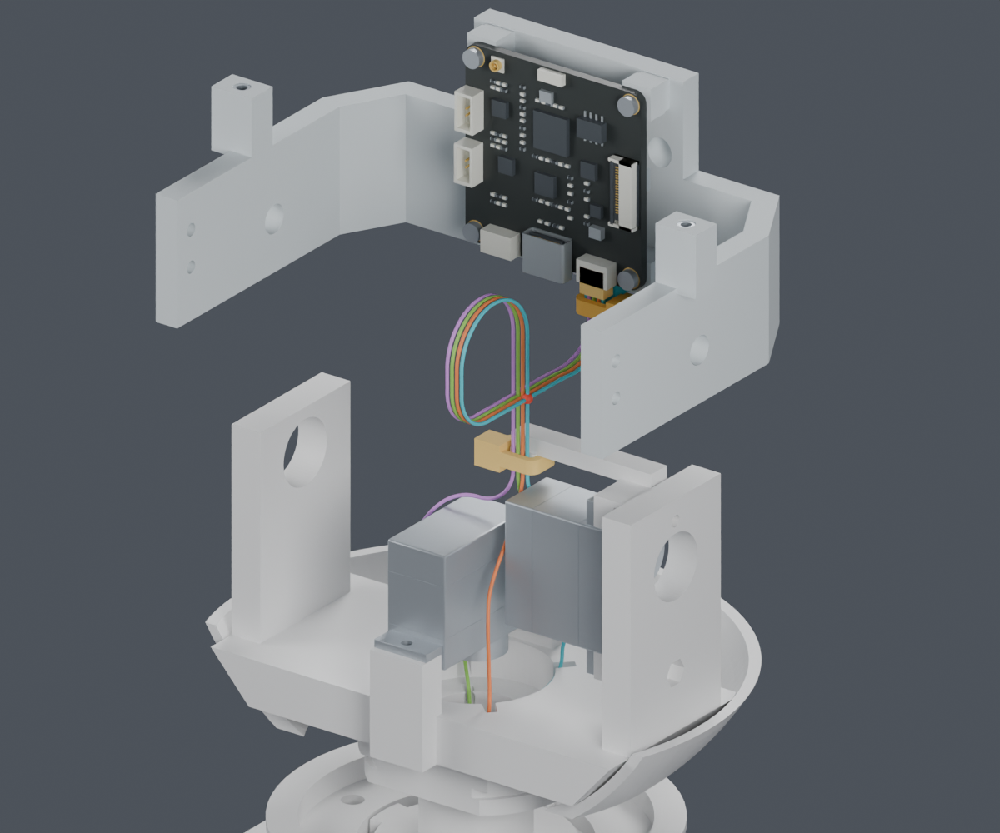
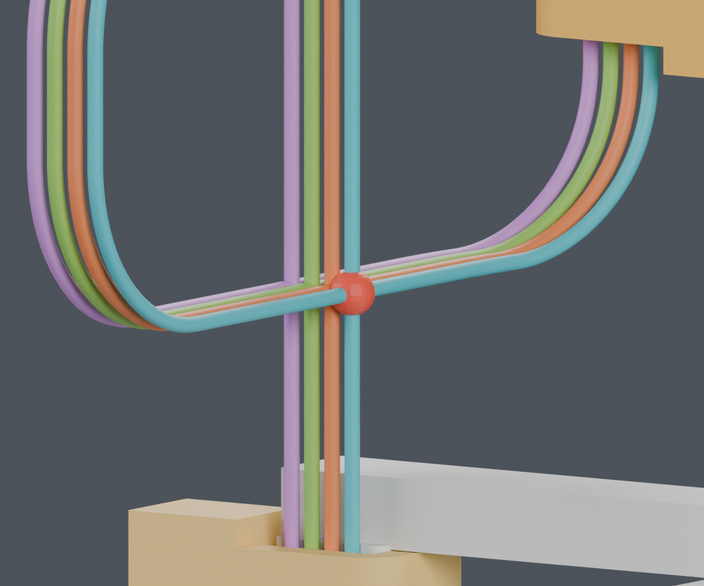
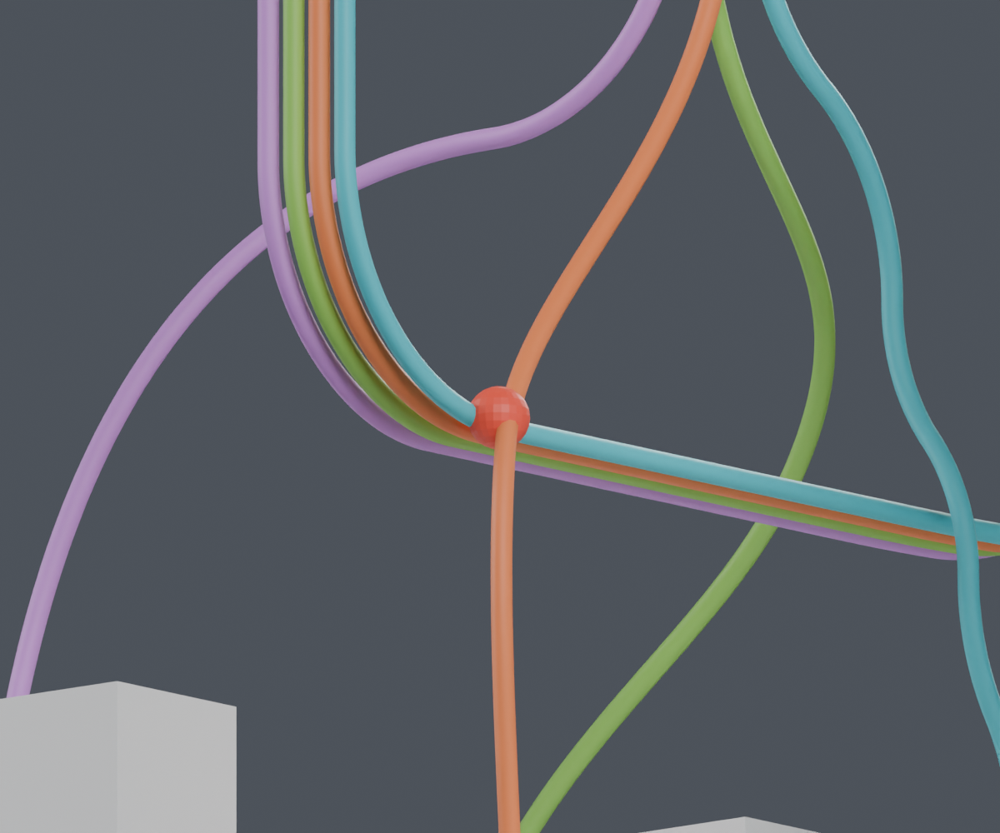

# CAM整段装配：下放路径与工序检查

**这轮排除了一个不能直接采用的装配组合。完整线束仍为 BLOCKED，主模型保持 M1.47。**

此前已分别检查颈部穿装、两个固定点、离机剪尾和装好后的线环。本轮将它们放在同一组装入位置检查，确认局部通过不等于能直接按原动画串起来安装。

## 头托抬高42mm时会发生什么

保持身体端和yaw侧导线不动，CAM板、插头、头托和插头侧扎带一起上移。每根线的活动段维持72.610689mm，四根CAM相邻尾段随板移动；没有把导线拉长来制造装配空间。

| 检查 | 结果 | 范围 |
|---|---|---|
| 15个位置的刚性零件检查 | PASS | 从0到42mm、间隔3mm；包含完整CAM板（UART单独计算）、插头、头托、两处扎带、现有固定件/候选结构 |
| 0、3、6mm的四线检查 | PASS | 仅这三个离散位置；不是0–6mm连续运动证明 |
| 9mm位置 | BLOCKED | CAM导线与另一条颈部引线的名义余量低于本研究要求的0.3mm |
| 12–27mm位置 | BLOCKED | 先发现与自身颈部过渡段的间隙不足；检查遇到首个失败后停止该位置的后续项目 |
| 30、33mm位置 | BLOCKED | 先发现CAM尾线与Pitch_Yoke间隙不足 |
| 36、39、42mm位置 | BLOCKED | 先发现非相邻线段回碰；42mm另做了明确相交见证 |

42mm处，同一根线相隔约69.5mm的两段在红点交叉。名义线径0.6604mm；这不是只差一个采样误差的情况，而是**当前规定线形的实体包络确有交叠**。图中没有模拟真实软线自然弯曲，不能据此断言所有装配方法都不可行。

9mm图中的红点表示低于0.3mm设计余量；它与42mm的实际包络相交是两个不同结论。局部图为看清线环隐藏了舵机、头托和CAM板；它们仍包含在相应检查中。

## 能否改变剪钳方向

沿用之前已记录尺寸的同一把剪钳工作包络，以自由尾端为轴试了8个方向、CAM组件0/6/12mm三种高度，以及yaw舵机已装/暂缓两种状态，共48组。

没有一组同时通过零件、既定线路和自由尾端工作区检查。向上工具在这些开敞工序中可避开刚性结构，但仍被已整理的线环挡住；其他方向多与侧壁、舵机或下方结构冲突。因此仅仅“晚装yaw舵机”尚未解决问题。

这排除的是**本次工具包络与规定线形的组合**，不是所有钳子、真实手部动作或可调整的松线位置。

## 对下一步装配设计的约束

1. 不能先锁紧两端、维持当前尾线形状，再把头托按旧动画抬高42mm。
2. 先剪尾、后理线的要求仍成立；两个局部离机步骤之间，必须补上整段松线如何暂存和转移。
3. 下一步先比较整体离机预装、身体端暂不固定及CAM板分步就位的顺序；有可检查的完整路径后再选用。当前没有为绕过冲突增设孔、凸台或零件。
4. 七根其余头部导线、FPC、身体侧固定和完整针腔视图仍待完成。当前四根路线的模型长度可继续参考，但不放行裁线。

原动画没有包含完整线束，本页不会把它标成已通过带线装配，也未替换正式动画。

## 文件与检查边界

- [独立Blender](review.blend)、[15个装入位置](screen.json)、[48组工具检查](sequence_tools.json)、[相交与间隙见证](witnesses.json)。
- [前一步：离机剪尾与模型长度基准](../cam_connector_install/index.html)。
- [复现命令](commands.json)、[图像来源](render_manifest.json)、[交付清单](review_manifest.json)。

主模型、正式STL、正式动画和硬件文件未修改。实体夹持、扎带穿紧、手部、制造公差和自然线形仍未验证。供应商按图制作已确定；当前资料不能用于生产下单。
