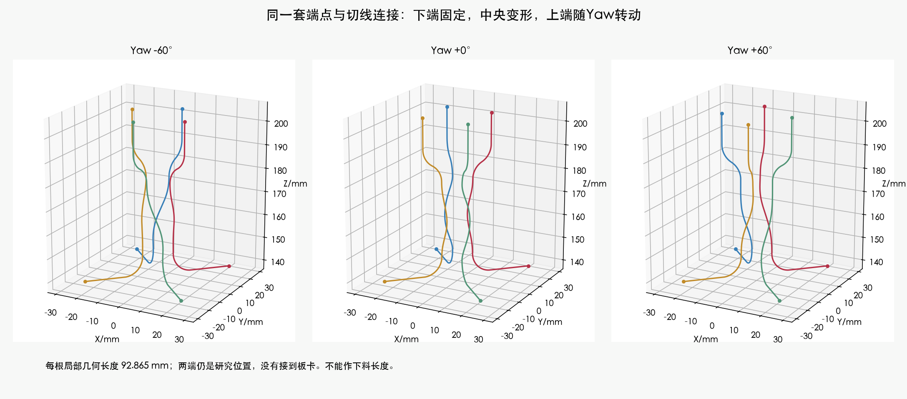
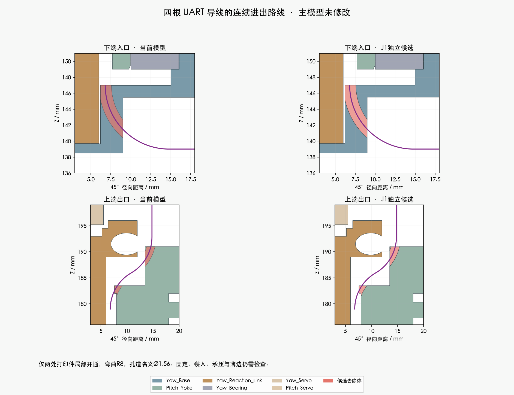

# J1：四根 UART 导线的连续进出候选

**主模型仍是 M1.47。J1 仅为独立副本，尚不建议应用，也不是供应商加工图。**

这次把下端、中央活动段和上端接成同一条路线。此前分开检查的段落没有被直接拼成“完整线束通过”。

## 本次已完成

- 四根线分别有完整、连续切线的局部路线：身体研究端点 → R8下弯 → 中央活动段 → R8上部S弯 → 随Yaw移动的研究端点。
- 保留原32 mm高活动段及其长度规律，整体下移3 mm至Z147–179；四根线的零位方位为45/135/225/315度。没有移动或缩放硬件。
- 每根局部中心线长度 **92.865 mm**；13个Yaw姿态计算保持。最小抽样曲率半径 **7.955 mm**，大于候选线材目录参考加线半径的6.9342 mm筛查值。
- 在独立副本中仅修改 **Yaw_Base、Pitch_Yoke**，其余207个实体几何和位置保持。两件仍各为一个连通实体。相对原件只做减料，轴承、舵机和螺钉位置不动。
- 13个Yaw×10个Pitch姿态、四根线共520个“导线×姿态”，未检出局部曲线与209源实体/既有代理、14根固定线候选的间隙失败。四线相互表面间隙的全参数下界 **6.414 mm**；另检查了抽样非局部自接近和两组外圈参考路线。

这是给定线形、离散姿态及名义尺寸的检查，不代表真实线束一定保持这个形状，也不代表动态疲劳、扭转或打印强度合格。

孔道刀具半径0.78 mm只是本次打印结构候选参数。Yaw_Base去除45.596 mm³，Pitch_Yoke去除29.174 mm³。距现有五金的间隙不等于剩余材料厚度；承压接触、开口边缘和疲劳仍未完成检查。

## 装入检查发现的实际问题

JST原厂SH目录第2页给出SSH-003T-P0.2-H名义示意尺寸3.9/1.35/0.8 mm，以及无凸耳SHR-04V-S胶壳5×5×2.8 mm。已保留来源、页码和哈希。这不是完整压接后端子公差图，也没有证明当前CAM板采用该厂牌/型号。

使用这两种**参考长方体包络**，在零位沿当前路线作切线随动穿入、分别尝试两种转向；四根路线共16项均出现包络与源实体重叠。因此不能把导线曲线检查直接当成插头/端子装入通过。

这只是16条具体穿入尝试失败：包络并非端子精确CAD，尚未检查任意姿态、临时拉直路径或分步拆装；也没有宣称所有装法都不可能。

接下来需要完成能够实际装入的方案，例如验证“一端预压端子、暂不装胶壳”的通道，或与关节装配顺序配合的开放放线结构。两者均尚未定型，不能先写成供应商必须执行的最终工艺。仍须补齐身体端固定、Yaw端固定、俯仰段、板端引出、完整分支和逐线长度。

**92.865 mm是研究端点之间的局部长度，不能下料。** 当前仍无最终加工长度，未向任何供应商发送图纸或订单。

## 资料与结果

- [源模型局部路线检查](../joined_entry_screen.json)
- [两处候选改动及实体检查](screening.json)
- [线间、弯曲和长度检查](../joined_wire_spacing.json)
- [端子/胶壳装入尝试](terminal_entry.json)
- [JST原厂SH目录](../../../../../hardware/v1_2/head_harness_A8_20261003/sources/JST_SH_20261003.pdf)
- [独立候选Blender](candidate.blend)
- [压接资料与来源限制](../TOOLING_DETAILS.md)

实际CAM插座、匹配SCS0009舵盘/传动叠层仍有资料缺口；完整机械路线、固定与装入是项目尚未完成的设计，不能全部归为等资料或等实物。

复现工具：Blender5.2.2 LTS（d13f752e3b9c）、Python3.12.14。运行记录在[命令清单](commands.json)。主模型SHA256：`bcaa5736a8cdf43441a6a83a6cb69606546cc01d2c0d28d98f4c09383e07368f`。
