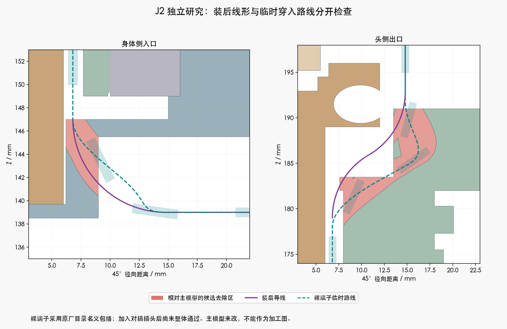
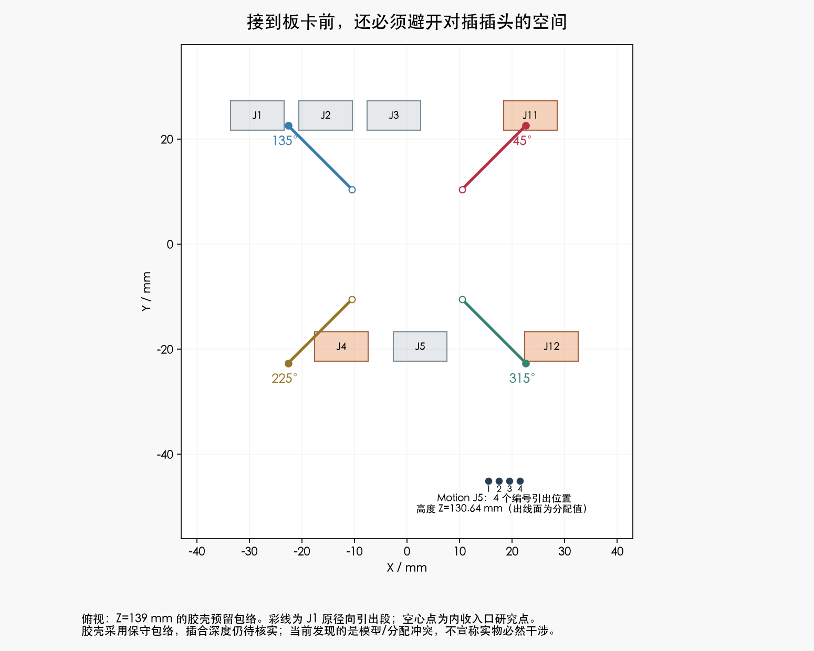

# J2：端子临时穿入与板端复核

<!-- amass-latest:start -->
**最新补充：**新互配尺寸已复跑，名义包络通过、上界分配未通过。[查看原厂图和最新结果](../amass_mating/README.md)。以下首次J2记录保留为历史，完整线束仍未完成。
<!-- amass-latest:end -->

**整体状态仍为 BLOCKED。主模型是 M1.47，未应用这两处候选打印件改动。**

这次找到了区别于装后线形的临时端子路线，同时补查了此前局部检查未包括的29个对插包络。后者暴露了板端过渡问题，不能只报局部通过。

## 已完成的具体检查

- JST SH 原厂目录中的3.9×1.35×0.8 mm名义示意，被明确建成参考长方体；不是完整压接后端子CAD。暂不装胶壳，零位穿过中央段，在两端给端子长度留出转向空间。
- 四个方向分别使用677段连续凸包覆盖，扣除插值误差后，参考包络对207个未改源实体/代理及14根固定线候选的间隙下界为0.315 mm。**这个PASS没有包含29个对插包络。**
- 只在独立副本更改Yaw_Base和Pitch_Yoke；其余207个物体保持。原始保存网格的退化面已在独立清理副本修正：重新打开后，两件均为单一闭合实体、无零面积面、无非流形边。局部面到面完整误差未认证；双向顶点到表面的最大抽样差为0.001373 mm，不能拿拓扑代替强度检查。
- 清理副本中，既定局部线形对209源实体/代理的130头部姿态、520个导线姿态实例检查通过。固定方式、随端子运动的软线、最小壁厚和承载仍未完成。

## 加入插头后，为什么还不能应用

旧J1径向段在45°、225°、315°三个方向进入了电源板J11、J4、J12的保守胶壳空间；13个Yaw姿态共39项未通过间隙检查。临时裸端子穿入的四个方向也分别与现有插头预留空间相交。

这些插头原来按完整未插合长度预留，**不是精确插合CAD，因此不把这一结果说成实物必然干涉。** 尚未确认“先穿线再装其他插头”的完整装配顺序，也没有省略插头来宣称全部通过。

已按基板Motion J5的真实针脚编号和2mm间距提取四个出线分配位置；CAM端仍只有照片估计区域，没有编造其真实针序视图或出线基准。

身体端分别尝试了单段三次曲线、R7出线转弯加平面曲线和降高S弯，以及把临时入口半径32mm内收到14.8mm的方案。内收版本只找到部分单线候选，未找到四线成组方案；有限家族失败不代表空间必然无解。没有移动板卡、互换针序、缩小真实硬件或为失败线路额外开孔。

## 新找到的原厂数据改变了下一步

[艾迈斯2025V1互配图](../amass_mating/README.md)明确给出XT30UPB-M与XT30U-F互配总长20.10±0.50mm，板端焊脚3.00±0.30mm。由此推导板上高度17.10mm、独立极限上界17.90mm。旧23.1mm只是未扣除插合量的保守分配，不能再把插合高度笼统列为找不到。

但新极限包络顶部可达当前电源板Z139mm，与旧径向线段同高，所以也不能直接撤销所有冲突。下一步先用这份资料重建插合空间，补齐焊接/绝缘出线，再继续板端和关节固定设计。无需先为旧过大包络修改打印结构。

完整俯仰段、CAM接口、相机FPC、固定/应力释放、拆装路径和逐线下料长度仍未完成。局部92.865mm不是加工长度。实际端子压接形状、配套舵盘和线材动态寿命仍有独立的资料或实物验证项。

## 文件

- [已清理的独立研究Blender](cleaned/candidate.blend)（未采用，不是可打印发布版）
- [保存/重载/插头复核](cleaned/reloaded_mated_audit.json)
- [网格清理记录](cleaned/storage_rebuild.json)；[最初失败的重载检查](reloaded_mated_audit.json)
- [207源物体的参考端子扫掠](candidate_screen.json)；[临时路线](transit_screen.json)
- [基板与CAM端点来源](../h06_ports.json)
- [原身体端曲线尝试](../body_leads/prefix_pools.json)；[R7过渡尝试](../body_leads/arc_prefix_pools.json)；[入口内收尝试](../body_leads/inner_arc_prefix_pools.json)
- [原厂互配尺寸](../amass_mating/received_dimensions.json)；[原厂压接参数与版本限制](../TOOLING_DETAILS.md)
- [命令记录](commands.json)

主模型SHA256：`bcaa5736a8cdf43441a6a83a6cb69606546cc01d2c0d28d98f4c09383e07368f`。工具：Blender5.2.2 LTS / d13f752e3b9c；制图Python3.12.14。硬件文件只读，未发订单或加工图。
