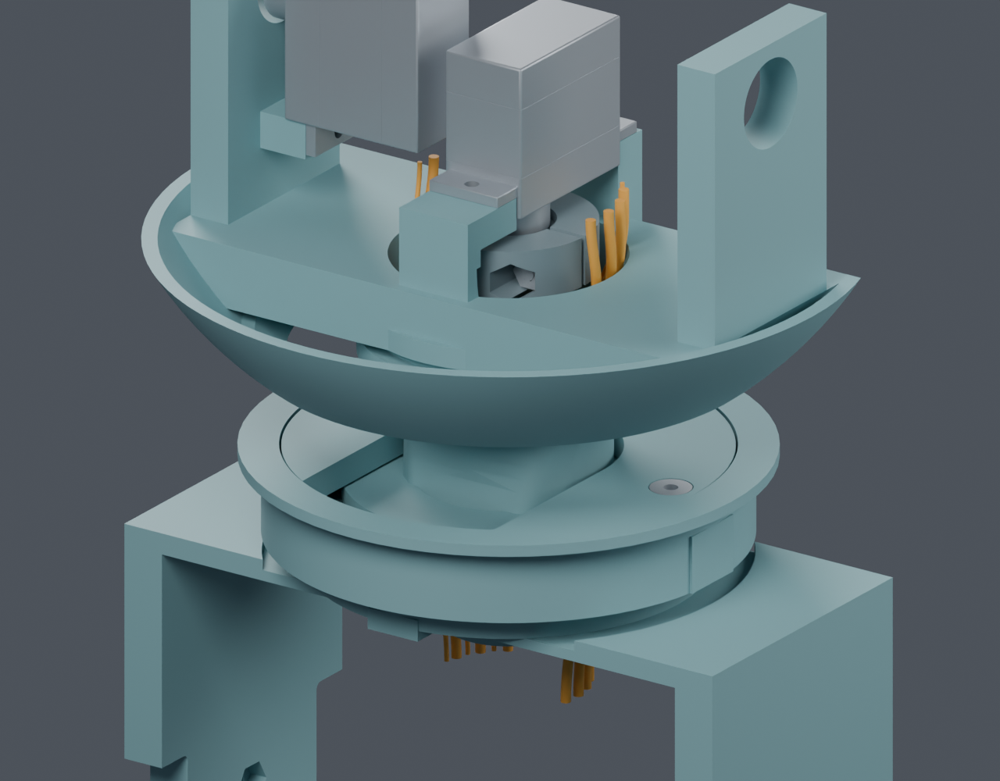
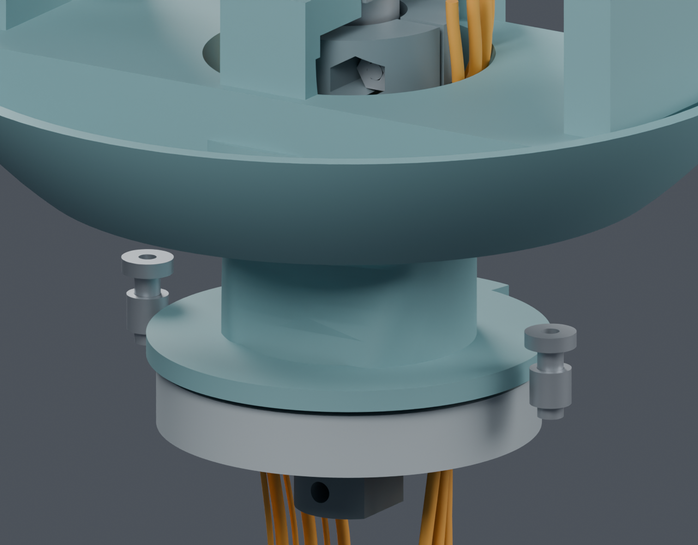
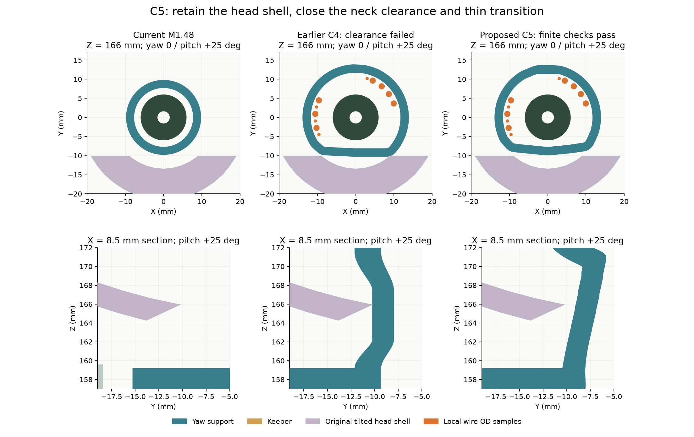

# C5：较大内孔轴承与连续颈部通道候选

候选局部数字检查 PASS；完整线束 BLOCKED；未应用主模型，尚待用户确认。

C5独立候选已通过11根局部导线、130姿态的实体检查、头壳净距与过渡壁厚采样，最小已查头壳名义间隙0.420mm、过渡侧壁采样约2.228mm；局部无新增软线的轴承/压板/螺钉装入和工具路径通过。需将偏航轴承20×32×7改为30×42×7并调整3件现有打印件，候选尚待用户确认，未应用主模型。完整端部连接、实际线材/FFC、固定与应力释放、完整带线装配及供应商制作图仍未完成。

| 修改 | 候选范围 |
|---|---|
| 轴承 | NSK6804ZZ 20×32×7 → NSK6806ZZ 30×42×7；分别按厂家边界重建，没有缩放硬件 |
| 打印件 | Yaw_Base、Pitch_Yoke、Yaw_Anti_Lift_Keeper 三件；无新增件、无新增紧固件 |
| 原位置 | 保持头壳、LCD、相机、舵机与四枚压板紧固件的位置；压板恢复原高度 |
| 保护区 | 原D形反力孔壁、两条原承力连接及上部舵机座保护区移除体积均为0 |
| 运动范围 | 保留正常 yaw ±60°、pitch −20°～+25°；限位首次采样相交在 ±64.25° |

蓝绿色是候选打印件；橙色是11根局部空间样本。头壳、屏幕等为观察隐藏，数字检查仍包括它们。两端是Z130/Z200临时端点，尚未全部连接真实接口。

上图隐藏固定桥和压板以观察旋转颈部；既有螺钉/嵌件因此悬空显示，并非最终装配状态。承力面和实体拓扑与检查使用相同NPZ，渲染仅按主模型的平面/曲面法线规则显示，没有改变顶点或三角形。

左为主模型，中为此前未通过的C4，右为C5。上排是Z166截面；下排是X8.5截面，均使用原后壳仰头25°后的实际实体。圆点只示意线径，图不是完整扫掠。

数字检查：11根局部路线与当前209实体、29对插包络、14根已有候选固定线检查通过；线间保守下界0.403mm。7根OD1.4224mm仍是空间样本，未选定或验证SH/GH压接线；4根OD0.6604mm使用Alpha2841/7目录最大外径参考，不是已采购线束。

130个有限姿态、43654个去重零件—姿态检查通过；原0.01mm³相交体积阈值保留，同时另行检查实际表面净距。颈部与原后壳最小已查间隙0.917mm；三件候选与头壳的最小值0.420mm出现在压板附近。过渡侧壁内外面顶点和三角形中心的最近面距离采样最小2.228mm，不是全局最小壁厚证明或承载资格。

压板侧装、支撑与压板成对落座、轴承竖直装入、两枚螺钉和2AF工具局部路径通过；这些检查不含新增软线，也未解决旧反力夹初装。防脱仍保留0.4mm名义游隙，0.39/0.41/1.0mm抬升采样得到预期自由/止挡关系，不是预紧或最终舵盘叠层合格结论。

[NSK6806ZZ来源](https://www.oss.nsk.com/tw/products/bearings/ball-bearings/deep-groove-ball-bearings/single-row-deep-groove-ball-bearings/6806zz-apn.html)与[存档清单](sources/manifest.json)：目录质量24g，原6804ZZ17g，轴承增加7g；没有据此声称整机重量增加7g。价格、库存、精密滚道CAD及实际配合未确认；不放行采购或制造。

仍需：真实接口端部、线材/FFC、固定和应力释放、完整带线装配、反力夹初装、供应商制作图、质量/驱动预算。PA12工艺、承载、磨损、线缆寿命等实物验证单列NOT_TESTED。

可编辑文件：[C5_review.blend](C5_review.blend)。检查：[构建](C5_build.json)、[实体与装入](C5_verification.json)、[净距与材料](C5_material.json)、[摘要](C5_review.json)。

工具：Blender5.2.2 LTS d13f752e3b9c，项目manifold；Python3.12.14。实际运行命令为同目录 build_candidate_v5.py、verify_candidate_v5.py、check_profile_material_v5.py、render_v5.py（Blender -b mechanical/mori_v1_2.blend --python-exit-code 1 --python）；plot_v5.py 和 publish_v5.py 用项目Python运行。日志均保存在本目录。
