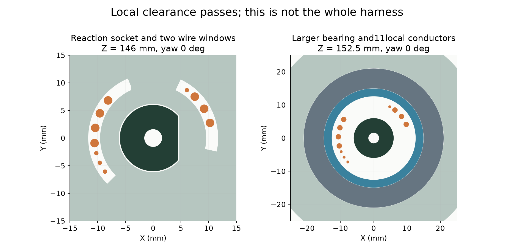
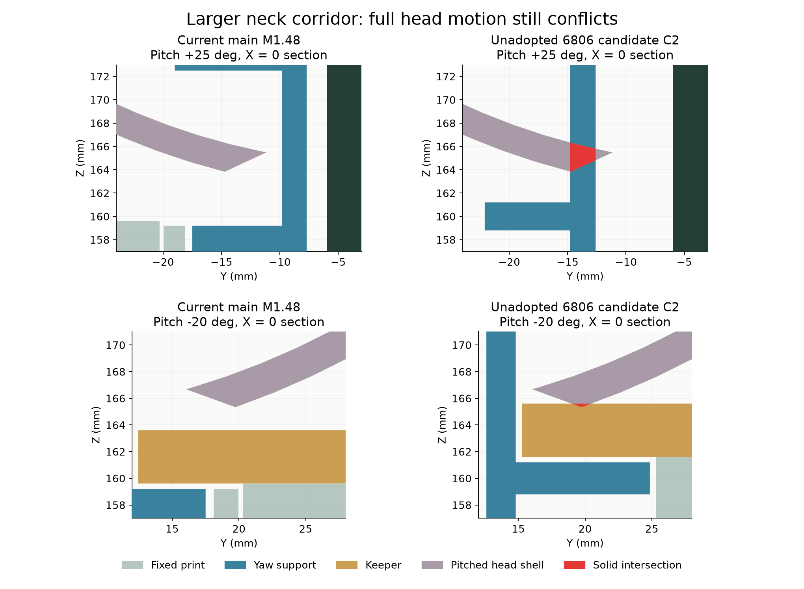

# 6806跨颈通道评估，主模型仍为M1.48

**BLOCKED；独立候选未采用。到货前仍有5类待办，完整线束是主要未完成项。**

原20×32×7轴承内侧的通道会损伤反力座。另一条外绕路线把活动段移到压板上方后，1296个局部候选也未通过：压板、电源板、CAM板或后壳仍阻挡。这仅是被测曲线族失败，不是所有外绕方案不可能。

本研究建立了30×42×7轴承的独立参考，重新构造3件打印件，不缩放原轴承、不移动PCB或光学件。尺寸来源是[NSK6806ZZ官方页面](https://www.oss.nsk.com/tw/products/bearings/ball-bearings/deep-groove-ball-bearings/single-row-deep-groove-ball-bearings/6806zz-apn.html)；原轴承依据[NSK6804ZZ官方页面](https://www.oss.nsk.com/tw/products/bearings/ball-bearings/deep-groove-ball-bearings/single-row-deep-groove-ball-bearings/6804zz-dgbb-sr.html)。官方目录标称质量分别24g和17g，增加7g仅指轴承，不是整机称重。完整滚道/防尘盖CAD、实测配合、价格及库存未确认。

## 局部通道结果



- 三件打印实体各自连通；原D形反力孔壁、两条原承力连接及上部舵机座保留，指定保护区移除体积为0。
- 11根局部曲线在130个有限头部姿态下通过检查，包含209原零件、29对插包络及14根已有固定候选线。线间最小保守下界0.668mm；最小采样弯曲半径19.144mm。这是几何结果，不是导线动态寿命验证。
- 四根信号线采用Alpha2841/7目录最大OD0.6604mm；另七根OD1.4224mm只是空间样本，未完成线材/端子选型，不可据此下单或压接。
- 上下端Z130/Z200仍是临时端点。不能与旧四线完整路线直接拼接，也没有生成可制作的裁线图。

## 整体复核未通过



- 43654个去重零件—姿态检查中出现33条新增相交记录，涉及3对零件；这不是33种独立缺陷。
- 仰头25°时，新偏航支撑颈部碰Head_Rear。抬高2mm的防脱压板在部分仰头姿态碰后壳，下俯20°时碰前壳。红色为真实实体交集。
- 固定/转动限位首次采样接触在±63.75°，早于原定64–64.5°检查区间，需调整；正常±60°范围的限位本身未相交。
- C1的限位根部挡住了轴承装入，已判废；C2把限位根部移到轴承外侧，轴承装入通过。C2的压板侧装、成对落座、螺钉装入及2AF工具局部路径通过，但都是**无新增软线**的有限刚体检查，不能代表完整装配。
- 两处嵌件导孔外1.2mm环状材料探针检查通过；轴颈名义壁厚2.35mm。两者不是全件最小壁厚、承载、PA12变形或蠕变验证。

下一步需要连同头底部的运动空间一起解决。主模型、正式STL、动画以及硬件源文件保持，不提交此候选打样。

## 可复现文件

- C1/C2的8件独立实体分别保存在C1_*.npz和C2_*.npz；3件打印件、1个轴承边界及4个平移2mm的既有紧固件。没有新增零件。
- [C2构建](C2_build.json)、[完整有限检查](C2_verification.json)、[本轮摘要](review.json)、[厂家来源](sources/manifest.json)。
- Blender5.2.2LTS d13f752e3b9c，项目manifold；报告Python3.12.14。实际日志保存在本目录。

```sh
/Applications/Blender.app/Contents/MacOS/Blender -b mechanical/mori_v1_2.blend --python-exit-code 1 --python mechanical/studies/prearrival_finish/neck_bearing_capacity_M1_48/build_candidate.py
/Applications/Blender.app/Contents/MacOS/Blender -b mechanical/mori_v1_2.blend --python-exit-code 1 --python mechanical/studies/prearrival_finish/neck_bearing_capacity_M1_48/build_candidate_v2.py
/Applications/Blender.app/Contents/MacOS/Blender -b mechanical/mori_v1_2.blend --python-exit-code 1 --python mechanical/studies/prearrival_finish/neck_bearing_capacity_M1_48/verify_candidate.py
/Applications/Blender.app/Contents/MacOS/Blender -b mechanical/mori_v1_2.blend --python-exit-code 1 --python mechanical/studies/prearrival_finish/neck_bearing_capacity_M1_48/collision_sections.py
/Users/dean/.cache/codex-runtimes/mori-cad/bin/python mechanical/studies/prearrival_finish/neck_bearing_capacity_M1_48/build_review.py
```

仍待：完整线路/FFC、固定、带线装配、反力夹初装、真实配套端子/舵盘、最终质量和驱动预算。所有实物及打印验证均另列NOT_TESTED。
