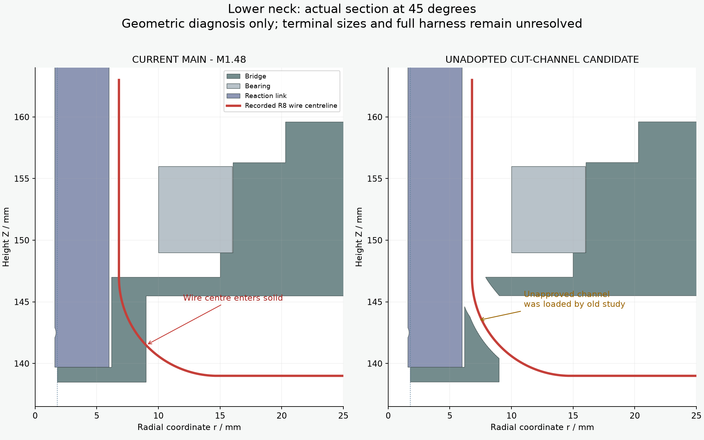
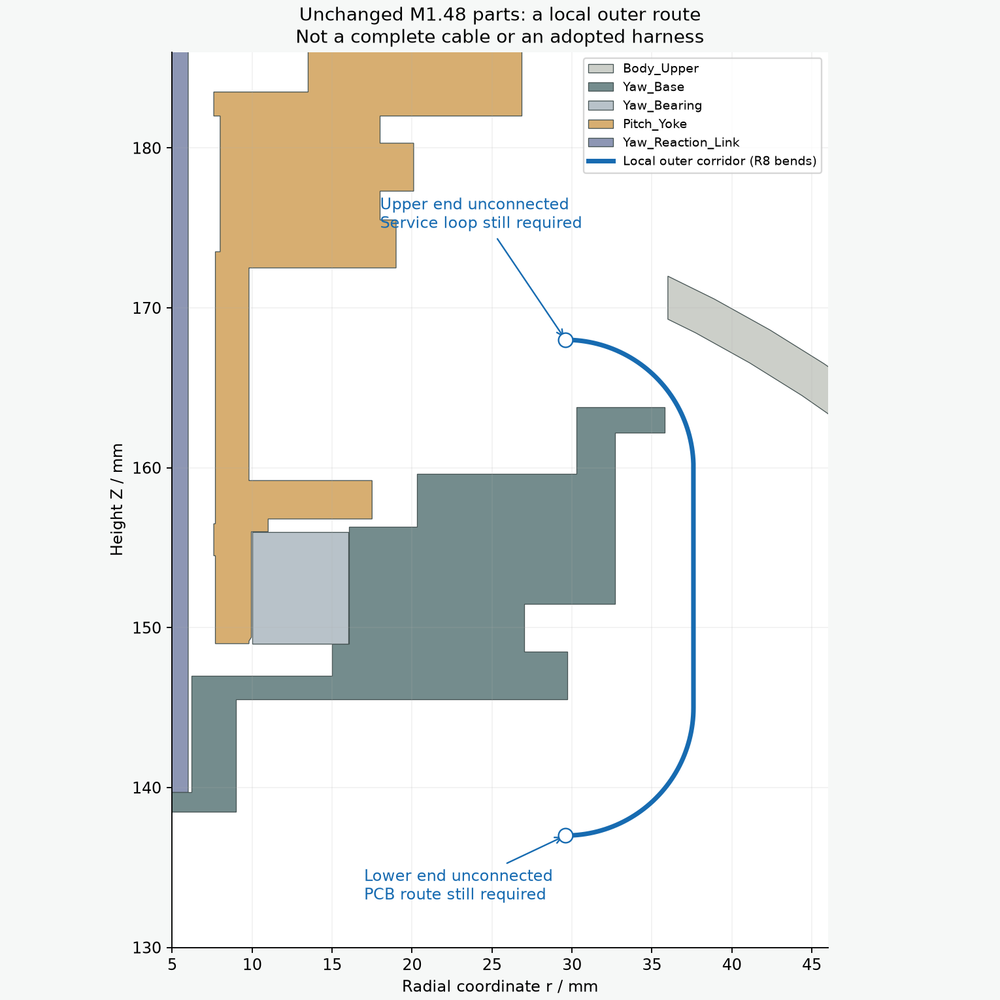

# M1.48：颈部研究来源更正与当前实体复核

更新时间：2026-10-05T04:29:20.478695+00:00。当前模型哈希：`d060e2a72114c9d1e9fba5e481a95997fa9b2fd202d0629005409614bc3ff7e7`。

旧“原桥座”研究用了未采用的切槽候选。与主模型相比，候选 Yaw_Base 移除约92.641mm³，Pitch_Yoke 移除约332.838mm³。旧保存剖面与候选相符，与主模型不符；初始化替换链和实体差分已记录。历史数值文件保留，原来源声明撤回。

直接加载当前主模型后得到两条有效的失败证据：

- 桥座下套224mm位置，第四根临时直立线尾的端子请求空间仍与底面相交2.718mm³；它是具体路线失败，不是所有装法都不可能。
- 原R8下弯路线在四个方位均穿进主模型。首个检出的中心入实体点在Z141.493mm附近，不能把旧候选的静态排布通过沿用给原件。

另外测试的四条“裸端子沿该R8弯逐渐转直”的路径，连未加余量的1×1.8×4.1mm名义端子也会碰到桥座；这些端子尺寸仍是ASSUMED空间，绝非厂家真实端子CAD。中央Ø3.6mm孔的结构用途是舵盘锁紧工具通道，没有改作永久走线通道。

## 不改打印件的替代方向

围绕原轴承外侧测试456条R8弯曲局部线段，72条在机械零位通过连续线段间隙检查。原上端Z172mm在91个头部姿态中有间隙失败，Z170mm版本仍在89个姿态中失败。最新候选把外侧半径调到37.6mm，下端保持Z137mm，上弯起点Z160mm、上端Z168mm；四个方位使用同一截面参数，选定的4段固定局部路径，在130个头部姿态下未检出间隙失败；这仅覆盖身体固定的颈部局部段。

线径0.6604mm、项目表面间隙0.3mm保持。检查用采样间距的一半及解析圆弧弦误差覆盖连续线段，并单独检查点是否在实体内；头部姿态仍是有限采样。四段相隔90°/180°，互相中心线距离下界41.861mm。

以下工作仍未完成：下端接到PCB的实际路径、上方偏航/俯仰服务环、完整四线长度和固定、真实端子/胶壳穿入、其余身体线/跨关节线与FFC、手和工具操作。外侧路径尚未应用，不能据此放行线束制作。主模型、参数、合同、STL和装配视频均保持M1.48本轮已交付状态，没有增加孔、切槽或零件。

## 原始记录

- [几何来源差分与加载链](source_audit.json)
- [主模型下弯与端子碰撞](native_threading_screen.json)
- [456条外侧局部路径](outer_corridor_screen.json)
- [最新候选130个头部姿态检查](outer_corridor_motion_lowest.json)
- [Z172mm版本失败记录](outer_corridor_motion.json) / [Z170mm版本失败记录](outer_corridor_motion_lower.json)
- [当前整体剖面](native_neck_context.png)
- [实际执行命令与来源](publication.json)
