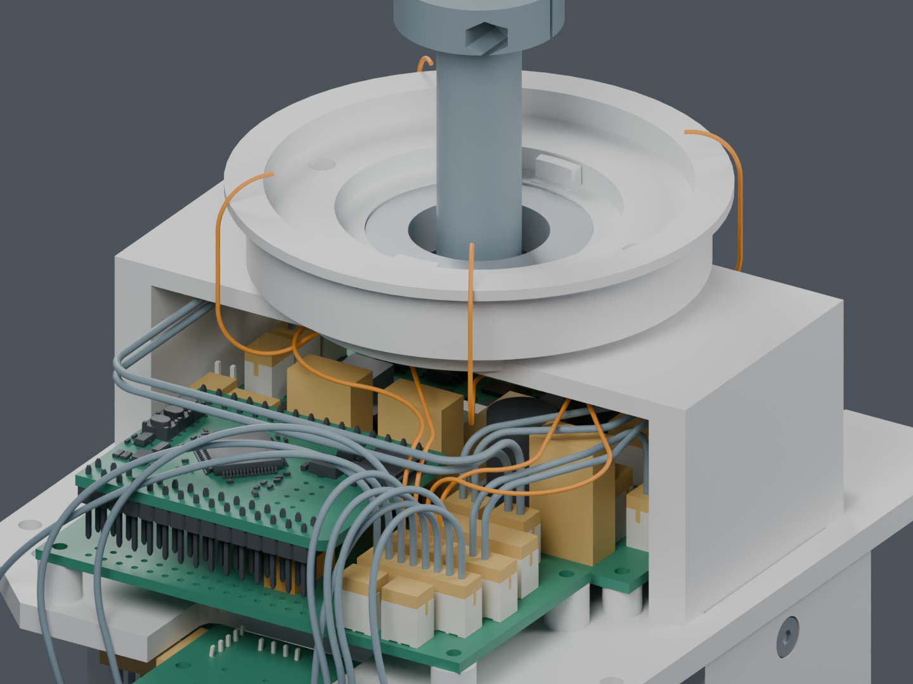
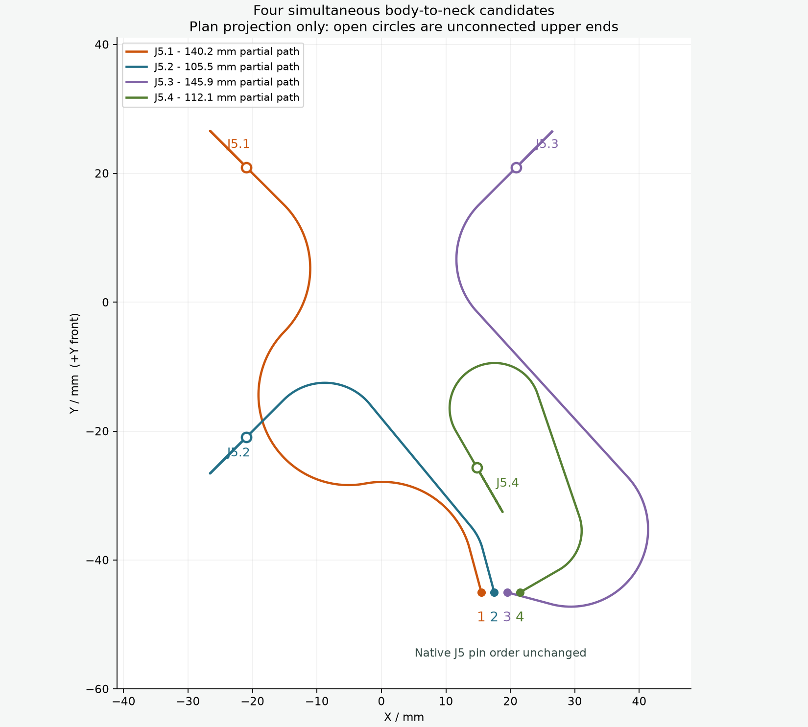
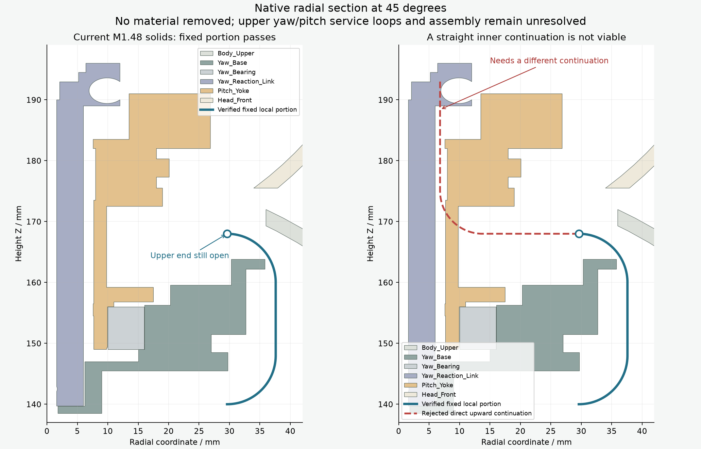

# M1.48：身体 J5 至颈部的四线候选

**四根下部路线一起通过名义几何检查；完整线束仍为 BLOCKED。**
主模型保持 M1.48。这次没有改打印件、板卡、孔位、STL 或正式装配动画。

## 已完成的范围

直接读取当前主模型的 209 件实体，并加入 29 个对插包络和 14 根已有候选线。
未加载任何未采用的桥座或头座切槽。三条旧外侧通路在补入插头后不再满足间隙，
因此只调整线的下弯高度和一个方位，板卡及插头位置保持。

四根线现在从基板 Motion J5 的原针序起点连续接到颈部 Z168 mm 的暂定交接点。
线径仍为 0.6604 mm、名义表面间隙要求为 0.3 mm，最小解析弯曲半径为 7 mm。
四线 6 对之间的保守表面间隙下界最小为 0.319 mm；130 个头部姿态未检出间隙失败。
每条线的连续曲线间隙包含采样间距和解析圆弧弦误差，头部姿态本身仍是离散检查。

| 身体端针脚 | 颈部暂定方位 | 本段中心线长度 / mm |
|---|---:|---:|
| J5.1 | 135° | 140.20 |
| J5.2 | 225° | 105.48 |
| J5.3 | 45° | 145.86 |
| J5.4 | 300° | 112.06 |

这些是**未接完的路径长度，不是裁线长度**，未包含上方活动段、端子/剥线长度或制作余量。
方位分配只是机械走向，没有改变电气针序。图中色彩只用于区分路径。

## 上方仍需设计活动段

简单内收再竖直向上的延长会穿入现有头座/反力连接区域，未采用。
另筛查 576 条保持在颈部外侧的 S 弯上行路线，34 条在机械零位通过；
它们都未能覆盖所查头部姿态，分别受头座或前后壳阻挡。这只排除这些整段固定的
有限候选，不能推导为所有走线方法均不可行。后续应设计固定端至运动端的活动线环。

## 仍未完成

- 偏航、俯仰活动段及它们与 CAM 插头的连续连接。
- 全部线的实际材料长度、扎线/应力释放、带线端子和胶壳装入顺序。
- 其余跨关节线和 FFC、完整带线装配及人手/工具操作。

29 个插头和压接出线仍含空间预留；14 根既有线也是候选，不能当成已经安装的实物。
没有发布供应商裁线图、采购或制造数据。已确认的相机上沿和 CAM 内六角螺钉仍保持 M1.48。

## 文件与核对

- [可编辑独立 Blender](review.blend)，橙色为这次四根候选，灰蓝色为已有候选线；隐藏的头部与外壳没有删除。
- [四线同时排布](packing.json) · [当前实体及 130 姿态](verification.json)
- [补入插头后的旧通路检查](neck_allocations.json) · [下端连接](body_prefix_pools.json)
- [直接延长失败](upper_entry.json) · [外侧 R7](outer_risers.json) / [R8](outer_risers_R8.json) / [R10](outer_risers_R10.json)
- [执行命令与哈希](publication.json) · [交付核对](delivery.json)

更新时间：2026-10-05T09:04:57.503139+00:00。
