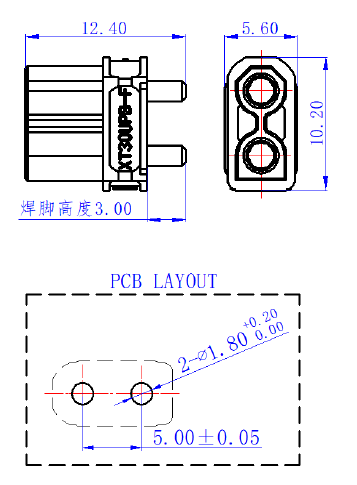
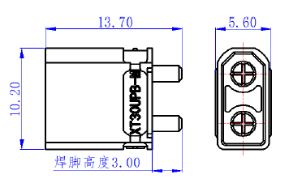

# 连接器与保险丝模型来源复核

本次只补充来源和区分模型精度，未修改主模型、PCB 或任何硬件文件。

## 主模型已有的内容

当前 `mechanical/sources/populated_P5R7/supplement_audit.json` 记录：

- 电源板 J1、J11、J12、J2、J3、J4、J5 已有 XT30UPB-M 尺寸重建包络，10.2 × 5.6 × 10.7 mm，本体外加 3 mm 焊脚。原生封装位置保持。
- 电源板 F60/F70 与后接口板 F1 已有 Littelfuse 451/453 尺寸包络，来源记录为 6.10±0.20 × 2.69±0.25 × 2.69±0.25 mm。
- A7/C4 接收报告中的“8 个 XT30、2 个保险丝库模型缺失”描述的是候选 PCB 的模型引用解析结果。它不能解释成主装配图漏放了这些器件；机械已有上述补充重建。

这些是尺寸包络，并非原厂 STEP，也没有实际测量资格。接触结构、插合深度、配套线端插头和焊接出线等仍不能据此判定完整安装通过。

## 本次新增的原厂图纸

从 [AMASS XT30UPB-F/M 产品页](https://www.china-amass.com/biao/276.html) 取得两张原始尺寸图，链接、取得时间和 SHA256 均保存在 [source_manifest.json](source_manifest.json)。页面图纸的替代文字为“正在上传”，但实际链接返回有效图纸，不应误判为没有图纸。

第二张图标注总长 13.70 mm、焊脚 3.00 mm，计算所得本体长为 10.70 mm；横截面为 10.20 × 5.60 mm，与当前 XT30UPB-M 重建的主要外形一致。第一张还给出 5.00±0.05 mm 引脚中心距与 PCB 推荐孔径。推荐 PCB 孔不等于已确认的焊脚直径；此次没有用孔径替代焊脚尺寸，也没有调整 PCB。

## 有界 CAD 检索的结果

本次读取了 KiCad packages3D 的 10.0.6 标签目录。AMASS 目录返回 2 个文件，均为 XT60；Fuse 目录返回 29 个文件，未发现名称匹配 XT30、451、453 或 Nano 的模型。两份完整目录响应保存在本目录，响应没有下一页，哈希见来源清单。

这是该版本、这两个目录的检索结果，不代表厂家或其他渠道不存在模型。KiCad 库即使有相似几何，也不能自动当作所选料号的原厂 CAD。未拿其他插头或不同保险丝封装替换。

**结论：当前相关器件没有漏建；主要外形有尺寸依据，完整插接和细部精度仍未完成。** 后续取得匹配料号的 STEP、插合图或实物后再补齐，不把重复搜索当成精度提升。
