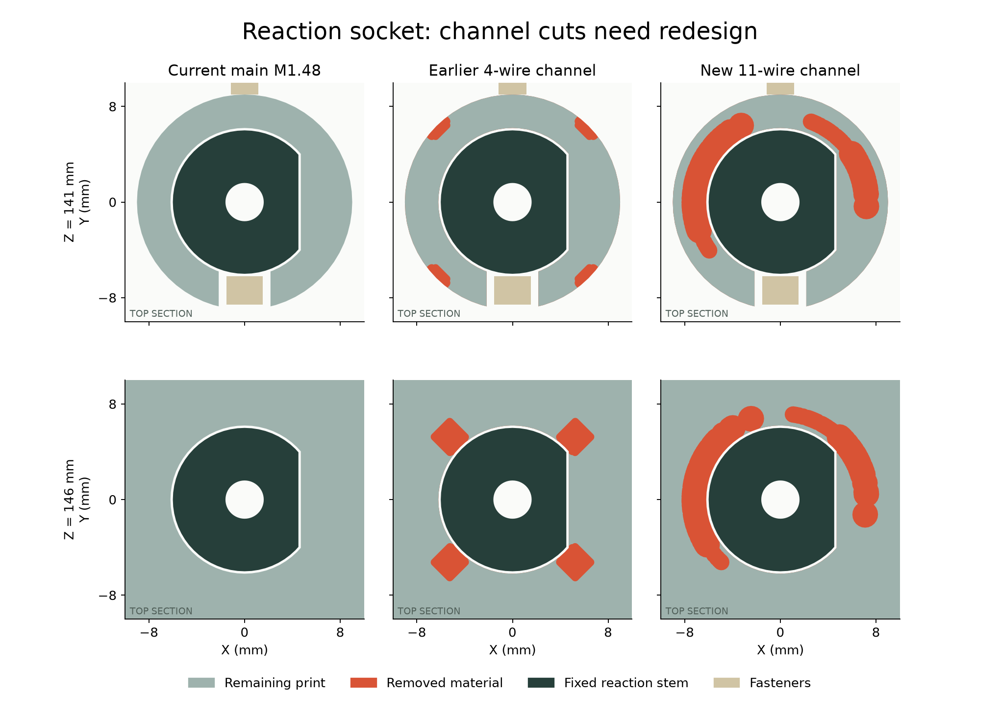

# M1.48 十一根跨颈导线：通道支座复核

当前状态：**BLOCKED，候选未采用，主模型未修改**。

## 新得到的结果

- 同时排下 11 根局部数学曲线：4 根信号线使用 Alpha 2841/7 目录最大线径 0.6604 mm；另 7 根使用 1.4224 mm 空间预留。后者不是已选线材，不能直接接到要求更细绝缘外径的 GH 端子，也不能据此发布线材采购单。
- 209 件当前零件为基础，包含 29 个插头包络、14 根固定候选线；先排除两件明确命名的通道宿主进行 130 姿态筛查，再构建两件通道单独重查。
- 导线共存、间隙和名义曲率通过相应有限检查；上下端 Z130/Z200 是临时截断位置，尚未连接到各接口。四根信号线的中段也改了，不能与上一版完整 CAM 路线直接拼接。
- 支座复核未通过：新的通道切穿了反力轴 D 形固定座的部分孔壁，并留下两个微小悬空残片。
- 已补查之前的四线通道：固定座顶部也出现孔壁局部开口。此前的路线、轴颈及局部装配 PASS 没有覆盖这项，不能据此放行固定座。

## 截面依据



Z146 截面原始孔壁的 720 条有效径向样本中，四线候选有 118 条、十一线候选有 222 条的原孔壁被新增开口取代。这是几何截面的采样统计，不是承载能力下降比例，也没有把边界尖端的径向宽度冒充全件最小壁厚。

轴颈 17 个截面 × 720 方向的最薄样本：原件 2.250 mm、四线候选 1.479 mm、十一线候选 1.677 mm。轴颈还存在材料，不能消除下方反力固定座的问题；强度和打印配合均未验证。

## 外绕的第一轮检查

尝试 R19.5 / R20.5、Z120–195 的局部定长曲线，同时保留两件宿主 R18 内的全部原始材料。288 条候选没有找到通过者：236 条首先碰到防脱压板，52 条首先碰到电源板。没有忽略、缩小或切开这些硬件来取得通过。这只是两组曲线族失败，不证明全部外绕路线不可行。

下一步将转动余量段移到防脱压板上方并分开通道，先保住反力固定座与轴承支撑，再接通两端、设计固定和检查装配。还没有可供用户批准的通道方案。

## 命令与边界

Blender 5.2.2 LTS，Python 3.13，使用项目已有 manifold。

```sh
/Applications/Blender.app/Contents/MacOS/Blender -b mechanical/mori_v1_2.blend --python-exit-code 1 --python mechanical/studies/prearrival_finish/whole_head_harness_M1_48/screen_neck.py
/Applications/Blender.app/Contents/MacOS/Blender -b mechanical/mori_v1_2.blend --python-exit-code 1 --python mechanical/studies/prearrival_finish/whole_head_harness_M1_48/pack_neck.py
/Applications/Blender.app/Contents/MacOS/Blender -b mechanical/mori_v1_2.blend --python-exit-code 1 --python mechanical/studies/prearrival_finish/whole_head_harness_M1_48/inspect_host_cuts.py
/Applications/Blender.app/Contents/MacOS/Blender -b mechanical/mori_v1_2.blend --python-exit-code 1 --python mechanical/studies/prearrival_finish/whole_head_harness_M1_48/check_host_sections.py
/Applications/Blender.app/Contents/MacOS/Blender -b mechanical/mori_v1_2.blend --python-exit-code 1 --python mechanical/studies/prearrival_finish/whole_head_harness_M1_48/check_host_sections.py -- --four-line
/Applications/Blender.app/Contents/MacOS/Blender -b mechanical/mori_v1_2.blend --python-exit-code 1 --python mechanical/studies/prearrival_finish/whole_head_harness_M1_48/screen_outside_bearing.py
/Users/dean/.cache/codex-runtimes/mori-cad/bin/python mechanical/studies/prearrival_finish/whole_head_harness_M1_48/build_review.py
```

实际日志分别保存于 screen.log、packing.log、host_cuts.log、sections.log、sections_four_line.log、outside_bearing_screen.log、build_review.log。结果中的 SOURCE SHA 指向 M1.48 当前主模型。旧研究的初始化代码没有执行；旧四线候选仅按已声明 NPZ 载入比较。

真实线材、动态寿命、完整端子/尾线、固定、连续运动、完整装配和最终裁线图仍未完成。硬件源、主模型、正式 STL 和视频保持不变；主版本仍为 M1.48 / 动画 M1.48-A1。
