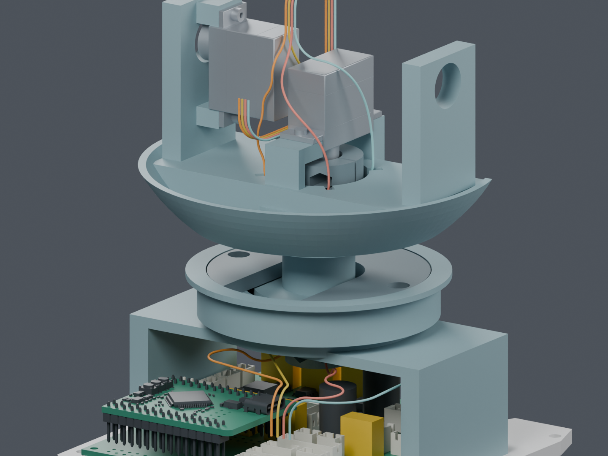
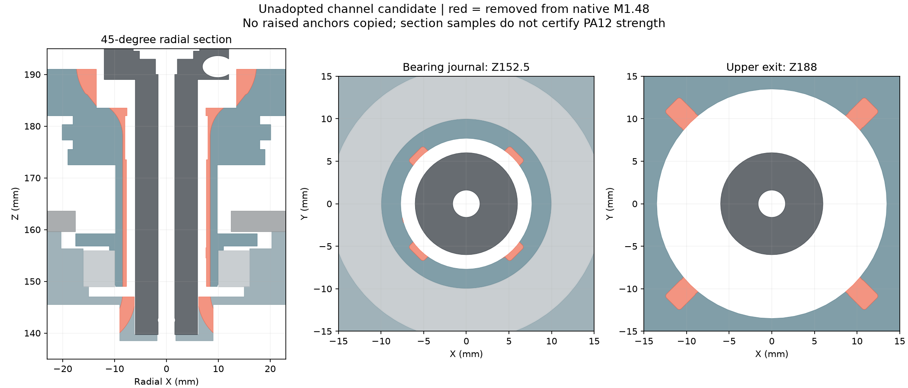

# M1.48：四根 CAM 连续路线与颈部通道候选

**四根 CAM 线从基板 J5 接到 CAM 出线预留位置的候选，通过本页列出的数字检查。
完整线束仍为 BLOCKED，两件通道候选尚未应用主模型。**

## 本次结果

- 直接读取 M1.48 的 209 件实体，仅以两个明确标识的独立通道候选替代 Yaw_Base、Pitch_Yoke。
- 检查包括 29 个对插包络和 14 根已有候选线；没有继承旧研究的实体间隙结论。
- 130 个组合姿态（偏航 −60° 至 +60°，俯仰 −20° 至 +25°）下，520 条线路与实体的名义间隙检查通过。
- 780 组线间检查、520 组非局部自接近检查通过。线间保守下界最小 0.300060 mm，要求 0.3 mm；这个下界不是制造余量。
- 线径仍为 0.6604 mm。匹配到原数学曲线的最小名义弯曲半径 7 mm，要求 6.9342 mm；未验证线材实际形态和动态寿命。

图中部分实体隐藏以便观察；检查时仍包含它们。末端使用 CAM 出线位置预留，
插合面、端子和逻辑针位对应仍需接口资料确认。颜色仅区分机械路线。

## 两件通道的代价

| 项目 | 相对当前主模型 |
|---|---:|
| Yaw_Base 移除材料 | 124.814 mm³ |
| Pitch_Yoke 移除材料 | 436.545 mm³ |
| 新增打印件 / 紧固件 | 0 / 0 |
| 轴颈有限截面采样最薄壁 | 2.250 → 1.479 mm |

没有带入历史候选的凸起固定座。两件均为单个连通实体，未检出零面积面或非二面边。
轴颈壁厚只检查了 17 个截面 × 720 个方向，不代表全部最小壁厚；不构成 PA12 强度结论。
局部网格存在很小的正面积三角形，尚未做候选制造导出放行。

此前的零厚度残片和粗采样保守告警已单独诊断，未用调小线径、放宽间隙要求或排除两个打印件来取得当前通过结果。
早期失败文件保留为过程记录；当前结果以 refined_adaptive_all、curve_packing_refined、radius_evidence 和 section_checks 为准。

## 仍需做的工作

1. 线的固定、应力释放、端子与胶壳装入，以及当前候选的完整带线装配。
2. 另 7 根跨关节导线、相机与屏幕 FFC；与已有 14 根身体候选线合并复核。
3. 两个通道对承载、装入路径及可制造性的完整复核。结构方案需用户确认后才能应用主模型。
4. 实际插合视图、压接出线、线材与供应商工艺数据；到货后再验证装配、磨损和寿命。

曲线是规定的数学形态；长度一致不证明柔性导线会自然保持这条路径。
姿态是离散检查，不是全连续运动碰撞证明。没有发布裁线尺寸、采购或制造数据。
主模型仍是 M1.48，正式 STL 和装配动画保持已批准状态。

## 原始文件

- [独立可编辑 Blender](review.blend)
- [实体与姿态](refined_adaptive_all.json) · [四线同时排布](curve_packing_refined.json)
- [曲率与来源](radius_evidence.json) · [拓扑和截面](section_checks.json)
- [两个通道的实体差异](refined_construction.json)
- [发布与哈希](publication.json) · [交付核对](delivery.json)

更新时间：2026-10-05T11:41:58.778911+00:00
