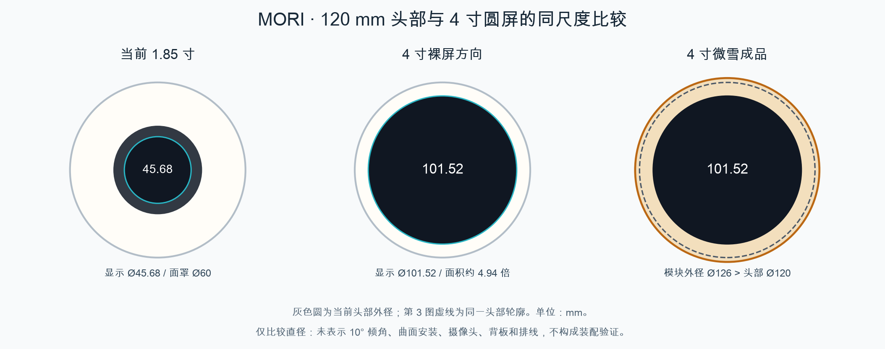

# 4 寸圆屏初评 · 2026-09-26

结论：4 寸可作为重新设计头部及交互电子系统的候选，不适合直接替换当前屏幕。保留 Ø120 mm 头部时，微雪两款 Ø126 mm 成品均不满足外形约束；约 106 mm 宽的裸屏仍需另做安装、摄像头和内部干涉评估。本研究没有替换 M1.36 模型，也没有修改任何硬件文件。



## 当前基准

`config/geometry.json` V1.2-M1.36：头部母球 Ø120 mm、壁厚 2.4 mm；LCD35079 实际显示直径 45.68 mm，当前黑面罩 Ø60 mm。屏幕及独立摄像头安装平面上仰 10°，头壳和主框架零位保持水平。当前整机名义高度 282 mm。

## 真实产品比较

| 路线 | 厂商公布 / 原始 CAD 尺寸 mm | 判断 |
|---|---|---|
| 微雪 4inch 720x720 LCD，HDMI | 显示 Ø101.52；整件 126×126×17 | 宽度超过整个头部；另需 HDMI 视频源。官方标称 5V、360mA、1.8W，仅适用于此 HDMI 型号。 |
| 微雪 ESP32-P4-WIFI6-Touch-LCD-4C，SKU31522 | 工程图：显示 Ø101.52、整件 Ø126、厚 15.1；完整 STEP 包络 126×126×15.5 | 集成主控仍无法直接放入现头壳。图纸与 STEP 厚度差 0.4 mm，须确认版本/具体突出特征；不把两者差异当成公差。 |
| Zhunyi Z40054 裸 LCD，MIPI | 显示 Ø101.52；LCM 不含 FPC 105.60×109.87×2.22 | 有缩减外围尺寸的空间，但裸屏厚度不等于包含驱动板、接口、安装和排线的整机厚度。尚无完整装配 CAD。 |

以上均是厂商资料，全部未经实物测量。Z40054 官网重量字段单位可疑，未作为有效质量输入。未取得新屏的可信实重、国内小批报价或采购链接确认；原项目 ≤1000 元约束未放宽。微雪 HDMI 国际页查阅价 USD89.99，不是国内到手价，不能据此放行预算。

来源：[微雪 HDMI 官方参数](https://www.waveshare.com/wiki/4inch_720x720_LCD)、[微雪 HDMI 产品页](https://www.waveshare.com/4inch-720x720-LCD.htm)、[P4 官方说明](https://docs.waveshare.com/ESP32-P4-WIFI6-Touch-LCD-XC)、[P4 官方 CAD 下载](https://files.waveshare.com/wiki/ESP32-P4-WIFI6-Touch-LCD-XC/ESP32-P4-WIFI6-TOUCH-LCD-4C-3D.zip)、[Z40054 厂商页面](https://www.zhunyidisplay.com/products/z40054-4-inch-720720-lcd-display-mipi-interface-500-cd-m2-round-tft-lcm/)。查阅日期均为 2026-09-26。

## 对 MORI 的影响

- 显示直径为现款 2.22 倍，面积约 4.94 倍；720×720 的像素数是当前 360×360 的 4 倍。相同格式全帧缓冲/传输量也增为 4 倍。RGB565 单缓冲为 1,036,800 字节，约 0.99 MiB；这不是帧率保证。
- Ø101.52 占头部直径约 84.6%，水平正投影每侧仅余 9.24 mm，尚未计黑边、壳厚或安装结构。现有独立额头摄像头不能直接沿用当前开孔及安装布局。
- 球面安装是更严格的约束：理想半径 60 mm 球上，Ø60 面罩弦平面距球心约 51.96 mm；仅容纳 Ø101.52 显示圆的弦平面只距球心约 31.99 mm，相差约 19.97 mm。即使不加外边框，也需将平面沿径向内移约 20 mm 或改变头部外形/前部结构。这是母球几何推导，不是对当前真实曲面或舵机的实体干涉测试；10° 倾角会旋转该径向，并非单纯沿世界 Y 平移。
- 现有 CAM33700 基于 ESP32-S3。S3 可支持 RGB 等 LCD 接口，但不能把本次 HDMI/MIPI 候选直接接到现有屏幕插座；接口、引脚、驱动及相机/音频并发均需重新设计验证。不能泛化为“所有 4 寸屏都必须换 MCU”。[Espressif RGB LCD 文档](https://docs.espressif.com/projects/esp-iot-solution/en/latest/display/lcd/rgb_lcd.html)
- P4 成品方案集成 P4/C6，采用 MIPI 显示和 CSI 摄像头接口；官方音频推荐 8Ω/2W 喇叭。现 CAM 的摄像头及 4Ω 喇叭方案都不能假定原插头直换。若进一步采用，需要硬件所有者评估整个交互方案，不能在机械文件中私自换选型。[P4 官方说明](https://docs.waveshare.com/ESP32-P4-WIFI6-Touch-LCD-XC)
- 头部新增质量及前向偏心会影响整机重心、俯仰负载和动态惯量。当前质量预算本身为 ASSUMED、至少 ±35% 不确定性，不能声称原 SCS0009 已验证可带动新头部。仅作敏感性分析：按整机估算 1435g、COM 高 111.1mm，在 Z230mm 净增加 50g，COM 升高约 4.0mm；100g 约 7.7mm。它们是假设增重，不是任何候选产品实重。

## 建议与边界

如果本版仍优先保证小头部、低重心、少板件及现有 CAM33700，暂不采用 4 寸成品模块。若大脸显示是优先目标，先比较“更小外边框的 4 寸裸屏 + 匹配显示主控”和“放大头部容纳完整 P4 模块”，需用户确认结构/电气方向后再做独立候选。不要直接把屏幕放大或把新模组缩小来凑空间。

本次状态：直径计算 PASS；两款 Ø126 模块在不变 Ø120 头壳内的外形筛查 FAIL；裸屏实际安装、固定结构、相机视场、组合 yaw/pitch、线缆、强度、实重和热功耗 NOT_TESTED；最终选型、电气集成及预算放行 BLOCKED。未生成生产 STL、改动 Blender 装配或更新装配动画。

## 可复核记录

官方 ZIP、PDF、STEP 保存在 `sources/`；来源与 SHA-256、现有输入文件哈希、计算公式及检查状态在 `evaluation.json`。

```sh
pdftoppm -f 1 -singlefile -scale-to 1800 -png mechanical/studies/round_display_4inch_review/sources/ESP32-P4-WIFI6-TOUCH-LCD-4C.pdf mechanical/studies/round_display_4inch_review/sources/4C_drawing
/Users/dean/.cache/codex-runtimes/mori-cad/bin/python mechanical/studies/round_display_4inch_review/build_review.py
```

STEP 读取方法：`OCP.STEPControl.STEPControl_Reader` → `TransferRoots()` → `BRepBndLib.AddOptimal_s(shape, box, False, False)`。原生坐标范围 X/Y ±63；Z -11.8700001 至 3.63 mm。单位由工程图交叉核对。图纸厚度 15.1 mm 与 CAD 15.5 mm 的差异已显式保留。
